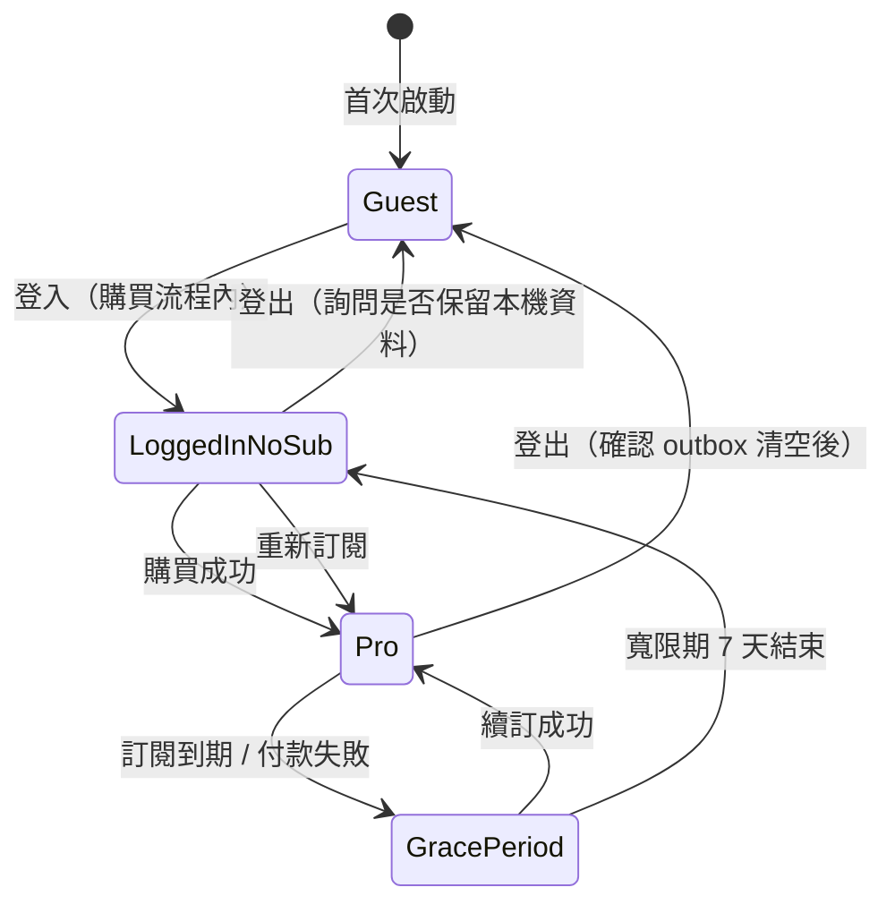
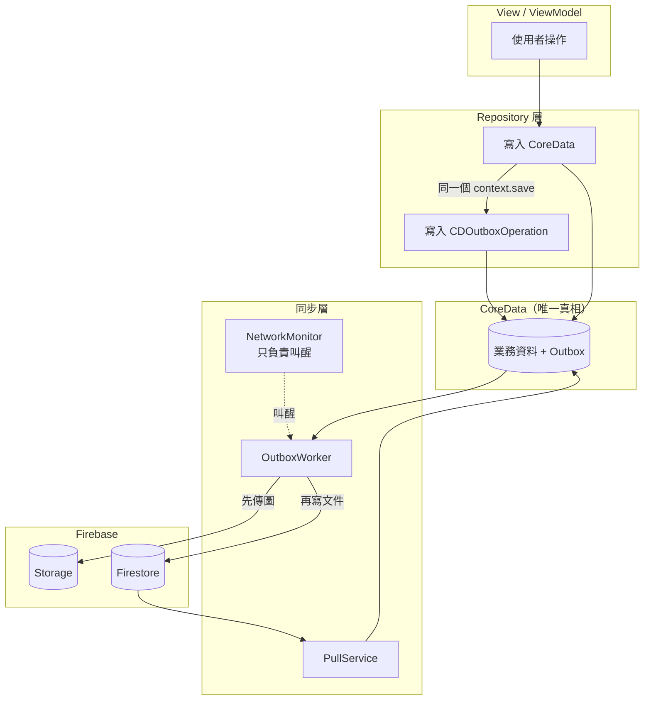
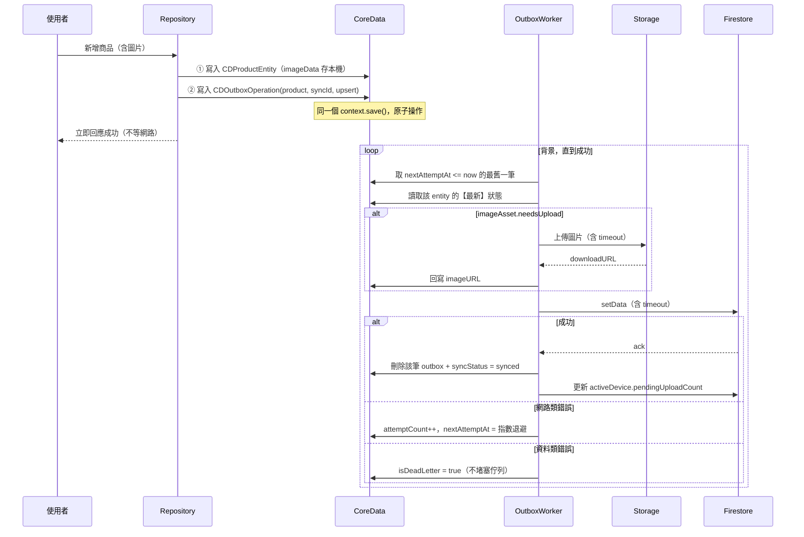
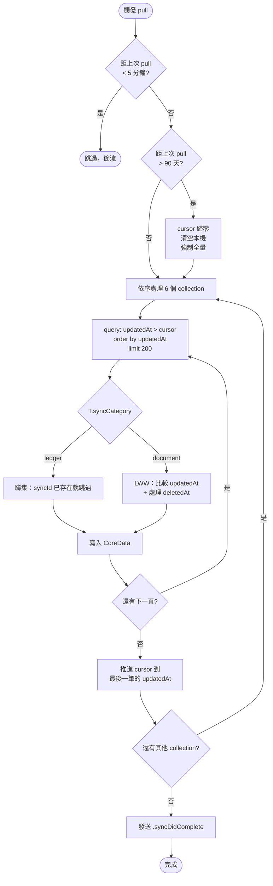
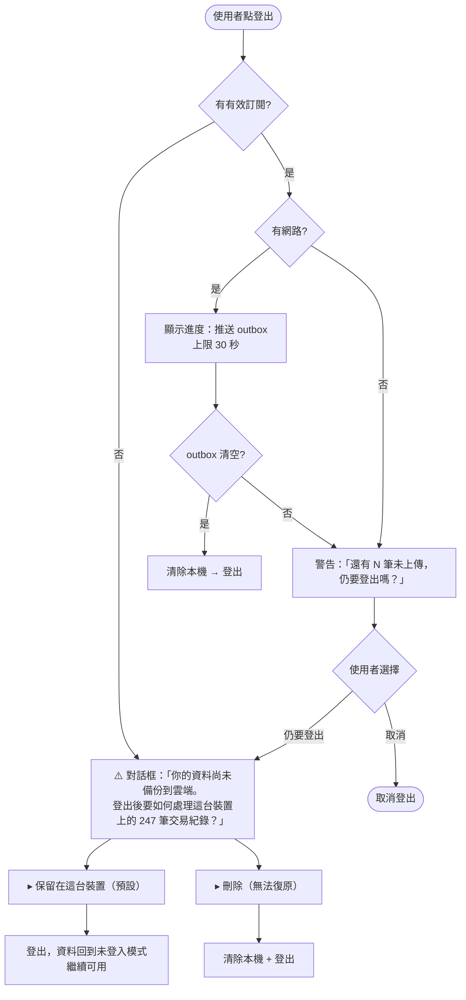
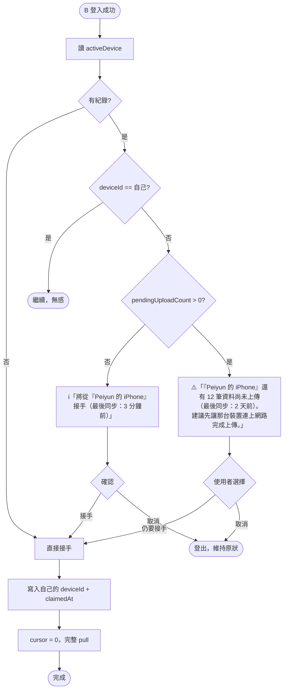
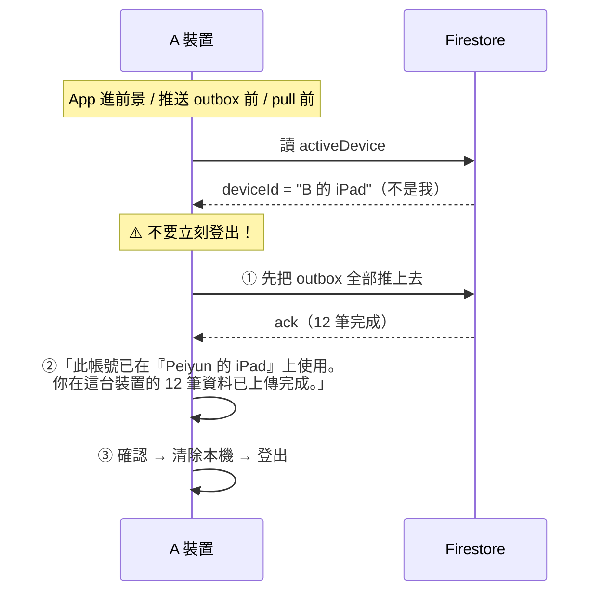
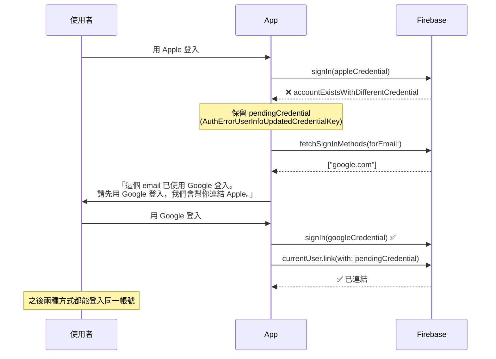
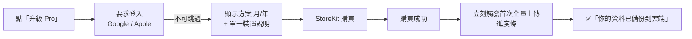

# Tilli 同步架構規劃 v2

> 建立日期：2026-09-10　最後更新：2026-09-11
> 取代對象：`SYNC_IMPLEMENTATION_PLAN.md`（設計）、`PRO_SYNC_BUGS.md`（見附錄 A）
> 狀態：規劃完成，待實作
>
> 📐 **資料結構以 `ARCHITECTURE.md` 為準。**
> 任何欄位的分類（即時值／快照／推導／純本機）、以及同步時怎麼處理，都看那份。
> 本文件與它衝突時，以 `ARCHITECTURE.md` 為準。

> **前提：App 尚未上架、沒有真實使用者，可以全部打掉重寫。**
>
> ## 🚨 開工前必讀
>
> **先看 `FEATURE_PLAN_V1.md` §14「待接同步清單」。**
> 功能開發期間新增的資料結構刻意沒有接同步，全部登記在那張表。
> 同時執行 `grep -rn "SYNC-PENDING" Tilli/` 撈出 code 內的標記，兩者交叉比對，
> 確認沒有任何欄位被遺漏在雲端之外。
> 因此本文件不追求「相容既有程式碼」，只追求「正確且沒有多餘的設計」。

---

## 目錄

1. [決策摘要](#1-決策摘要)
2. [核心原則](#2-核心原則)
3. [資料分類：三類、兩種行為](#3-資料分類三類兩種行為)
4. [抽象設計](#4-抽象設計)
5. [版本與訂閱規劃](#5-版本與訂閱規劃)
6. [Firestore Schema](#6-firestore-schema)
7. [CoreData 變更與欄位清理](#7-coredata-變更與欄位清理)
8. [同步架構](#8-同步架構)
9. [網路與錯誤處理](#9-網路與錯誤處理)
10. [Device Handoff（裝置交接）](#10-device-handoff裝置交接)
11. [庫存 Ledger 設計](#11-庫存-ledger-設計)
12. [Tombstone 軟刪除與狀態語意](#12-tombstone-軟刪除與狀態語意)
13. [收款方式（多張 QR 卡片）](#13-收款方式多張-qr-卡片)
14. [帳號與登入](#14-帳號與登入)
15. [訂閱與 App 內購買](#15-訂閱與-app-內購買)
16. [成本控制](#16-成本控制)
17. [刪除與重寫清單](#17-刪除與重寫清單)
18. [實作順序](#18-實作順序)
19. [測試清單](#19-測試清單)
20. [待確認事項](#20-待確認事項)
21. [附錄 A：設計陷阱清單](#附錄-a設計陷阱清單)
22. [附錄 B：Apple UID 診斷計畫](#附錄-bapple-uid-診斷計畫)

---

## 1. 決策摘要

| 項目 | 決策 | 理由 |
|------|------|------|
| 後端 | **保留 Firebase** | 未來可能出 Android 版；CloudKit 會綁死 Apple 生態，也無法做跨平台訂閱權利 |
| 多裝置 | **不做「同時登入」**，只做「換裝置接手」 | 消滅超賣問題與 90% 的同步複雜度 |
| 本機儲存 | **CoreData 為唯一真相** | Firestore 只是備份與傳輸層 |
| Firestore 持久化 | **關閉**（MemoryCacheSettings） | 避免兩套離線佇列打架、避免快取餵錯誤資料給分支判斷 |
| 上傳 | **Outbox Pattern（write-ahead，只存指標）** | 「離線」不再是分支；自動 coalescing |
| 下載 | **Pull by Cursor** | 全量與增量共用同一段程式碼；天生冪等 |
| 即時 Listener | **完全移除** | 不做同時多裝置就不需要；同時省下一半寫入成本 |
| 抽象 | **`SyncableEntity` 協定** | 新增 entity 不用動同步層 |
| 庫存 | **Ledger 推導**，`stock` 停止同步 | 衝突在數學上不可能發生 |
| 刪除 | **Tombstone 軟刪除** | 消除「已刪除 vs 還沒上傳」的歧義 |
| 衝突策略 | 流水帳=聯集、文件=LWW（serverTimestamp） | 規則統一，只有兩種行為 |
| 裝置協調 | **Device Handoff** | 後到者可接手，但顯示前一台的未上傳筆數 |
| 收款方式 | **多張 QR 卡片**（使用者自訂名稱 + 顏色） | 不內建第三方品牌，零商標風險 |
| 登入 | **Apple + Google，完整 Account Linking** | — |
| 免費版 | 單日場次無限、商品數不限、歷史不限、收款碼不限 | 核心功能不閹割 |
| 付費版 | 多日/永久場次、雲端備份、換裝置、進階功能 | 保險性質 = 自然的付費理由 |
| 訂閱 | 年 + 月（同一 Subscription Group）、7 天試用 | — |
| 訂閱驗證 | 第一版純 StoreKit 2 on-device；entitlement 欄位先預留 | 跨平台等有 Android 再接 |
| 止血修補 | **不做**，直接重寫 | 沒有使用者要保護；約一半是白工 |

---

## 2. 核心原則

```
① CoreData = 唯一真相。Firestore 是備份與傳輸層，不是資料庫。
② 「離線」是常態，不是例外分支。
③ 任何 gate 都必須留一條免費的出路。
④ 結帳流程永遠不能被擋住。
⑤ 只有「確認已備份到雲端」的資料，才可以清除本機。
⑥ 任何會累加/遞減的數字，一律做成流水帳，絕不做成文件欄位。
⑦ 流水帳存歷史快照；文件不存快照，顯示時 join。
⑧ 不要用「缺席」推論「已刪除」。
⑨ 不要靜默跳過、不要靜默失敗。任何 return 都要留下痕跡。
⑩ 同步層不該知道任何 entity 的特殊性。
```

---

## 3. 資料分類：三類、兩種行為

整個同步引擎只需要懂兩種行為。所有 entity 都必須歸進以下三類之一。

| 類別 | 成員 | 上傳 | 下載合併 | 衝突 |
|------|------|------|----------|------|
| **流水帳** (Ledger) | `Transaction`、`InventoryChange` | 只新增，永不改/刪 | 聯集（id 已存在就跳過） | **不可能發生** |
| **文件** (Document) | `Event`、`Category`、`Product`、`PaymentQRCode`、`UserProfile` | `setData` 整份覆蓋（upsert） | LWW by `serverTimestamp` + tombstone | 罕見、可接受 |
| **推導** (Derived) | `stock`、營收統計、庫存報表 | **永不上傳** | 本機從前兩類重算 | 不存在 |

### 為什麼這個分類是整個架構的基礎

- 流水帳是 append-only + UUID 主鍵 + 合併=聯集，這是最簡單的無衝突資料型別（grow-only set），數學上保證收斂。
- 文件的併發編輯罕見且低風險，LWW 足夠。
- 推導值不同步就不會衝突。

### 原則 ⑦ 的三個應用

「流水帳存快照、文件不存快照」這條規則決定了幾個反正規化欄位的去留：

| 欄位 | 所屬 | 決定 | 理由 |
|------|------|------|------|
| `Transaction.eventTitle` | 流水帳 | ✅ **保留，且永不更新** | 收據要顯示「當時的場次名稱」，會計上才正確 |
| `Transaction.items`（含商品名/價） | 流水帳 | ✅ 保留快照 | 同上 |
| `Transaction.paymentQRCodeLabel` | 流水帳 | ✅ 保留快照 | 卡片被刪或改名，歷史報表仍知道是用哪個收的 |
| `Product.categoryName` | 文件 | ❌ **刪除欄位** | Product 不是歷史紀錄，沒理由存快照；顯示時從 relationship 取 |

> ⚠️ 現況的 `EventRepository.swift:589` 會在改場次名稱時更新**所有** Transaction 的 `eventTitle` 並全部重新上傳 —— 一場 500 筆交易的市集，改一次名字 = 500 次寫入。這同時違反「Transaction 不可修改」的原則。**新架構直接不更新。**

---

## 4. 抽象設計

現況每新增一個 entity 要改 **7 個地方**（`syncXXX`、`enqueueXOperation`、`uploadX`、`updateX`、`downloadX`、`saveX`、`getEntityName`）。這是「繞圈寫法」的主要來源。

### 4.1 `SyncableEntity` 協定

```swift
enum SyncCategory {
    case ledger      // append-only，合併 = 聯集
    case document    // 可編輯，合併 = LWW + tombstone
}

protocol SyncableEntity: Codable {
    static var entityType: SyncEntityType { get }
    static var collectionName: String { get }      // Firestore 子集合名
    static var coreDataEntityName: String { get }
    static var syncCategory: SyncCategory { get }

    /// 同步識別碼。Product → id.uuidString；UserProfile → uid
    var syncId: String { get }
    var updatedAt: Date { get }
    var deletedAt: Date? { get }

    /// 需要上傳的圖片（沒有就回 nil）
    var imageAsset: ImageAsset? { get }

    func toFirestoreData(userId: String) -> [String: Any]
    init?(firestoreData: [String: Any])
}
```

有了它之後：

| 現況 | 之後 |
|------|------|
| 14 個 `syncXXX()` | `enqueue<T: SyncableEntity>(_:id:op:)` |
| 12 個 `uploadX` / `updateX` | `push<T: SyncableEntity>()` —— 一個實作 |
| 6 個 `downloadAllX` + `syncFromServer` + `downloadEntities` | `pull<T: SyncableEntity>()` —— 一個實作 |
| `getEntityName(for:)` 的 switch | `T.coreDataEntityName` |
| 散在各處的 ledger/document if-else | `T.syncCategory` |

**新增一個 entity = 寫一個 conformance，同步層完全不用動。**

### 4.2 `syncId` 為什麼是 String 而不是 UUID

| Entity | 數量 | 識別碼 | 誰發的 |
|--------|------|--------|--------|
| Event / Category / Product / PaymentQRCode | 一個使用者有很多個 | `UUID` | 本機自己發 |
| **UserProfile** | 一個使用者恰好一個（singleton） | **`uid`** | **Firebase Auth 發的** |

UserProfile 不需要 UUID 來「區分彼此」，因為只有一個；而 uid 本身就是它的身分，Firestore 路徑也是 `users/{uid}`。硬給它一個 UUID 只會多一層沒用的間接。

**問題從來不是「用 uid」，而是同步層被迫知道這件事：**

```swift
// ❌ 現況：捏一個假 ID 塞進不合身的介面
enqueueOperation(entityType: .userProfile, entityId: UUID(), ...)
// 然後到處 guard 掉它
guard entityType != SyncEntityType.userProfile.rawValue else { return }

// ✅ 之後：同步層只認字串
extension ProductModel:     SyncableEntity { var syncId: String { id.uuidString } }
extension UserProfileModel: SyncableEntity { var syncId: String { uid } }
```

假 ID 與所有 guard 全部消失。

### 4.3 `ImageAsset` 統一圖片規格

現況 Product / QRCode / UserProfile 的圖片處理**完全不一致**：

| 項目 | Product | QRCode | UserProfile |
|------|---------|--------|-------------|
| `imageData` 型別 | `Data?` | ⚠️ `Data`（非 optional） | `Data?` |
| Storage 路徑 | `products/{id}.jpg` | ⚠️ `qrcode.png`（固定檔名） | ⚠️ `profile.jpg`（固定檔名） |
| 上傳觸發 | `imageChanged` 參數 | ⚠️ 每次都重傳 | `imageChanged` 參數 |
| URL 處理 | 直接用 | 直接用 | ⚠️ 加 `?t=timestamp` |
| 上傳路徑 | `uploader.uploadProduct` | `uploader.uploadQRCode` | ⚠️ 繞過 uploader |

統一成：

```swift
struct ImageAsset {
    let localData: Data?
    let remoteURL: String?
    let storagePath: String    // 由 entity 提供
    let spec: ImageSpec        // .thumbnail(200, .jpeg) / .qrCode(512, .png)

    /// 需要上傳 = 有本機圖但還沒有雲端 URL
    var needsUpload: Bool { localData != nil && (remoteURL?.isEmpty ?? true) }
}
```

| 規則 | 說明 |
|------|------|
| Storage 路徑一律用 entity id | `users/{uid}/products/{id}.jpg`、`users/{uid}/paymentQRCodes/{id}.png`、`users/{uid}/profiles/{uid}.jpg` |
| **移除所有 `imageChanged` 參數** | 改由 `needsUpload` 自行判斷 |
| **移除 profile 的 `?t=timestamp`** | Storage 覆蓋上傳本來就會換 download token，URL 自然會變；加時間戳只會讓 Kingfisher 每次重下載 |
| `imageData` 一律 `Data?` | 修掉 `CDQRCodeEntity` 的非 optional |

> 移除 `imageChanged` 同時修好一個現存 bug：`uploadEventWithChildren` 完全不上傳圖片，導致**從場次流程建立的商品圖片永遠只在本機**。因為新的判斷不依賴呼叫端記得傳參數。

---

## 5. 版本與訂閱規劃

### 5.1 功能對照

| 功能 | 免費版（本機版） | Pro（雲端版） |
|------|------------------|---------------|
| 帳號 | 不需要 | Google / Apple 登入 |
| POS 結帳（現金／電子支付） | ✅ 完整不限制 | ✅ |
| 商品／類別／庫存管理 | ✅ 完整 | ✅ |
| **單日場次** | ✅ 無限 | ✅ 無限 |
| **多日場次** | ❌ | ✅ |
| **永久場次** | ❌ | ✅ |
| 商品數量 | 不限 | 不限 |
| 歷史保留期 | 不限 | 不限 |
| **收款 QR 卡片張數** | 不限（待確認，見 §20） | 不限 |
| 交易紀錄／基本報表 | ✅ | ✅ |
| 折扣 | ✅ | ✅ |
| 手動匯出備份檔（CSV + 專屬格式） | ✅ | ✅ |
| ☁️ 雲端自動備份 | ❌ | ✅ |
| 📱 換裝置一鍵接手 | ❌ | ✅ |
| 📊 進階功能（進階報表、CSV 匯出…） | ❌ | ✅ |
| （未來）Android 共用 | ❌ | ✅ |

### 5.2 訂閱狀態機



### 5.3 到期後的 Gate 行為

**原則：結帳流程永遠不能被擋住；任何 gate 都留一條免費的路（單日場次）。**

| 到期 + 寬限期 7 天後 | 多日場次 | 永久場次 | 單日場次 |
|---|---|---|---|
| **繼續結帳（新增交易）** | ✅ 直到場次結束 | ❌ 停止 | ✅ 永遠可以 |
| 新增商品 | ❌ | ❌ | ✅ |
| 建立新場次 | ❌ | ❌ | ✅ |
| 編輯場次（單日改多日） | ❌ | ❌ | ✅（改成多日除外） |
| 查看所有歷史資料 | ✅ | ✅ | ✅ |
| 進階報表 / CSV 匯出 | ❌ | ❌ | ❌ |

- **多日場次為什麼可以跑完**：它會結束（最多幾天），避免「客人站在面前不能結帳」的災難。
- **永久場次為什麼不行**：它永遠不會結束，允許繼續結帳等於永遠免費，付費模式破洞。被鎖時**提供「建立單日場次繼續營業」的入口** —— 這是那條免費的路。

### 5.4 到期前的警告時間軸

```
到期前 7 天  → App 內橫幅：「訂閱將於 X/XX 到期，到期後常設場次將無法新增交易」
到期前 1 天  → 再次提醒（可考慮推播）
到期日       → 進入寬限期（7 天），功能完全正常，橫幅常駐且明顯
寬限期結束   → 永久場次停止新增交易
             → 提供入口：「建立單日場次繼續營業」/「立即續訂」
             → 所有歷史資料照常可讀
```

使用者在被鎖之前至少被告知 4 次。

### 5.5 Gate 檢查點清單

| # | 位置 | 檢查 |
|---|------|------|
| 1 | 建立場次選擇 `dateType` | `.multi` / `.permanent` 需要 Pro |
| 2 | **編輯場次儲存時** | 防止「建立單日 → 改成多日」繞過 |
| 3 | 複製場次 | 複製多日/永久場次需要 Pro |
| 4 | 結帳按鈕 | 永久場次 + 已過寬限期 → 擋 |
| 5 | 新增商品 | 多日/永久場次 + 已過寬限期 → 擋 |
| 6 | 進階報表入口 | 需要 Pro |
| 7 | CSV 匯出 | 需要 Pro |
| 8 | 雲端同步啟動 | 需要 Pro（無訂閱不寫 outbox） |

> **可繞過性**：使用者可以開 3 個單日場次代替 1 個三日場次。**刻意不堵** —— 願意這樣麻煩自己的人本來就不會付費，且分散的報表本身就是懲罰。

---

## 6. Firestore Schema

### 6.1 結構總覽

```
users/{uid}
  ├─ (文件本身：email, name, photoURL, provider, accountStatus,
  │              createdAt, updatedAt)
  │
  ├─ private/activeDevice        ← 新增：Device Handoff
  ├─ private/entitlement         ← 新增：訂閱權利（跨平台預留，client 唯讀）
  │                                 ⚠️ syncState 已移除
  │
  ├─ events/{eventId}
  ├─ categories/{categoryId}
  ├─ products/{productId}
  ├─ transactions/{transactionId}
  ├─ inventoryChanges/{changeId}
  └─ paymentQRCodes/{qrCodeId}   ← 原 qrCodes，改為集合語意
```

### 6.2 所有資料文件的共通欄位

| 欄位 | 型別 | 說明 |
|------|------|------|
| `userId` | String | 冗餘欄位，方便 rules 與查詢 |
| `updatedAt` | **Timestamp（serverTimestamp）** | ⚠️ **必須是 server 時間** —— pull cursor 依賴它單調遞增 |
| `deletedAt` | Timestamp? | 僅 Document 類。`null` = 未刪除 |

> **重大變更**：現況 `ModelFirestoreExtensions.swift` 的 `updatedAt` 全部是 `Timestamp(date: Date())`（本機時鐘），必須全部改成 `FieldValue.serverTimestamp()`。裝置時鐘倒退會導致 cursor 漏抓資料。
> 若需要顯示「使用者編輯的時間」，另存 `clientUpdatedAt`，不參與同步判斷。

#### ⚠️ 流水帳也必須有 `updatedAt`（2026-09-12 補正）

查核發現 **`Transaction` / `InventoryChange` 目前完全沒有 `updatedAt`** ——
CoreData entity 沒有這個欄位，`ModelFirestoreExtensions.swift:187 / :271`
的 `toFirestoreData` 也沒有寫入。

這對**現況**是正確的（流水帳 append-only，下載用 skip-if-exists，不需要 LWW），
但對 **pull-by-cursor 是致命的** —— 沒有 server-side 時間欄位就無法做增量下載，
只能每次全抓，成本與正確性都會出問題。

**修正**：

| 項目 | 規則 |
|------|------|
| 欄位名 | **統一叫 `updatedAt`**（不要另外叫 `createdAt`），讓 `SyncableEntity.updatedAt` 對六個 collection 都成立，pull 不需要分支 |
| 值 | 建立當下的 `FieldValue.serverTimestamp()` |
| 之後 | **永不改變**（append-only 的語意：建立時間 = 最後更新時間） |
| CoreData | `CDTransactionEntity` / `CDInventoryChangeEntity` 新增 `updatedAt: Date?`<br>✅ **已排入功能開發期處理**（`FEATURE_PLAN_V1.md` §14.3 第 1 項、執行順序 1.11），同步重構時欄位應該已經存在 |
| LWW | 流水帳仍然**不參與 LWW**，`updatedAt` 純粹當 cursor 用 |

> 連帶：`FEATURE_PLAN_V1.md` §2.7 的 `PendingSyncStamp` 會自動涵蓋這兩個 entity
> （它會偵測 entity 有沒有 `updatedAt` 欄位），補上欄位後就會自動被設定。

### 6.3 `private/activeDevice`

```javascript
{
  deviceId: "A1B2C3D4-...",          // identifierForVendor
  deviceName: "Peiyun 的 iPhone",    // 給人看的
  claimedAt: <serverTimestamp>,
  lastSeenAt: <serverTimestamp>,
  pendingUploadCount: 0,             // ⭐ 這台還有幾筆沒上傳
  lastSyncedAt: <serverTimestamp>
}
```

`pendingUploadCount` 由當前裝置在 outbox 變動時回寫。**這是交接協議的核心** —— 讓接手的裝置知道前一台還有多少資料沒回來。

### 6.4 `private/entitlement`（跨平台預留）

```javascript
{
  pro: true,
  expiresAt: <Timestamp>,
  source: "apple",                   // "apple" | "google" | "promo" | "manual"
  productId: "com.tilli.pro.yearly",
  originalTransactionId: "...",      // Apple: originalTransactionId
                                     // Android: purchaseToken
  autoRenew: true,
  inGracePeriod: false,
  environment: "production",         // "production" | "sandbox"
  updatedAt: <serverTimestamp>
}
```

⚠️ **只能由 Cloud Function 寫入，client 唯讀**，否則使用者可以直接改成 `pro: true`。

**第一版不寫這份文件**，訂閱狀態純靠 StoreKit 2 on-device 驗證。欄位定義先寫好，做 Android 時再補 Cloud Function + App Store Server Notifications webhook。

### 6.5 Firestore Rules

```javascript
rules_version = '2';
service cloud.firestore {
  match /databases/{database}/documents {
    match /users/{userId} {
      allow read, write: if request.auth != null && request.auth.uid == userId;

      match /{collection}/{docId} {
        allow read, write: if request.auth != null && request.auth.uid == userId;
      }

      // entitlement：client 唯讀，只有 Cloud Function（admin SDK）可寫
      match /private/entitlement {
        allow read: if request.auth != null && request.auth.uid == userId;
        allow write: if false;
      }

      match /private/activeDevice {
        allow read, write: if request.auth != null && request.auth.uid == userId;
      }
    }
  }
}
```

> ⚠️ **關鍵規則：不要在 rules 層檢查 deviceId。**
> `deviceId` 是 UX 層的協調機制，不是安全層的鎖。若在 rules 擋掉「非活躍裝置」的寫入，被踢掉的裝置上那些未上傳的資料就永遠上不去了。權限只看 `uid`。

### 6.6 索引

Pull query 的形狀：

```
collection("users/{uid}/events")
  .whereField("updatedAt", isGreaterThan: cursor)
  .order(by: "updatedAt")
  .limit(to: 200)
```

單欄位排序 + 範圍查詢 → Firestore **自動建立單欄位索引**，不需要手動加複合索引。

> ⚠️ **pull 時絕對不能過濾 `deletedAt`** —— 必須把墓碑一起抓下來，否則刪除永遠同步不到其他裝置。過濾是在**本機讀取端**做（見 §12.4）。

---

## 7. CoreData 變更與欄位清理

### 7.1 新增欄位

| Entity | 新增 | 說明 |
|--------|------|------|
| `CDEventEntity` | `deletedAt: Date?` | tombstone |
| `CDCategoryEntity` | `deletedAt: Date?` | tombstone |
| `CDProductEntity` | `deletedAt: Date?` | tombstone |
| `CDPaymentQRCodeEntity` | `deletedAt: Date?` + 見 §13 | tombstone |
| `CDTransactionEntity` | `paymentQRCodeId: UUID?`、`paymentQRCodeLabel: String?` | 見 §13.3 |
| 全部 | `syncStatus` 新增 `local` 值 | 見下 |

### 7.2 刪除 / 降級的欄位

| 欄位 | 處置 | 理由 |
|------|------|------|
| `CDProductEntity.categoryName` | ❌ **刪除** | 反正規化造成更新風暴；改用 relationship 取（原則 ⑦） |
| `CDProductEntity.stock` | ⚠️ **降級為本機推導快取** | 從 `toFirestoreData` 移除，永不上傳（§11） |
| `CDProductEntity.isDisabled` | ⚠️ **語意純化** | 只代表「下架」，不再兼任偽刪除（§12.5） |
| `CDCategoryEntity.isDisabled` | ⚠️ **語意純化** | 同上 |
| `CDPendingSyncOperation` | ❌ **整個 entity 刪除** | 由 `CDOutboxOperation` 取代 |
| `CDUserProfileEntity.membership` / `expiryDate` | ⚠️ 降級為快取 | 真相來源改為 StoreKit / entitlement |

### 7.3 保留的反正規化欄位（刻意保留，註明用途）

| 欄位 | 為什麼保留 |
|------|-----------|
| `Category.eventId`、`Product.eventId`、`InventoryChange.eventId`、`Transaction.eventId` | Firestore 沒有 relationship，查詢與重建關聯需要 |
| `Product.categoryId` | 同上 |
| `Transaction.eventTitle` / `items` / `paymentQRCodeLabel` | **歷史快照**，流水帳語意（原則 ⑦），且**永不更新** |

### 7.4 補齊的不對稱

| 問題 | 處置 |
|------|------|
| `CDInventoryChangeEntity` 有 `productId` 卻**沒有** product relationship（但有 event relationship） | 補上 `product` relationship + inverse |

### 7.5 `syncStatus` 的新語意

| 值 | 意義 |
|----|------|
| `synced` | 已確認寫入雲端 |
| `pending` | 有 outbox 紀錄等待上傳 |
| `local` | **新增** —— 無訂閱，刻意不上傳 |

`local` 是關鍵：無訂閱期間**不寫 outbox**（省空間），改用此標記。續訂時做一次 reconcile，掃描 `syncStatus != "synced"` 全部塞進 outbox。

> `error` 這個值移除 —— 新架構不會「放棄重試」，失敗只會停在 `pending` 或進 deadLetter。

### 7.6 新 Entity：`CDOutboxOperation`

| 欄位 | 型別 | 說明 |
|------|------|------|
| `id` | UUID | |
| `userId` | String | **新增** —— 避免跨帳號污染 |
| `entityType` | String | |
| `entityId` | String | ⚠️ 是 **String 不是 UUID**（配合 `syncId`） |
| `operationType` | String | **只有 `upsert` 和 `delete`** |
| `createdAt` | Date | 排序用 |
| `attemptCount` | Int16 | 只影響退避時間，不會放棄 |
| `nextAttemptAt` | Date | 指數退避 |
| `lastError` | String? | 診斷用 |
| `isDeadLetter` | Bool | 資料類錯誤 → 移出主佇列，避免堵塞 |

### 7.7 ⭐ 關鍵設計：outbox 只存指標，不存 payload

**只存 `(entityType, entityId, operationType)`，送出時才從 CoreData 讀最新狀態組 payload。**

| | 存快照（現況） | **存指標（新）** |
|---|---|---|
| 連改 10 次 | 10 筆紀錄，上傳 10 次 | **1 筆，上傳 1 次** |
| 送出的內容 | 當時的舊快照 | **永遠是最新狀態** |
| 佇列體積 | 含 base64 圖片，數百 KB/筆 | 約 50 bytes/筆 |
| 順序問題 | 要處理 10 筆的先後 | 沒有（只有 1 筆） |

**Coalescing 規則**（寫入 outbox 時）：

```
查詢是否已有同 (userId, entityType, entityId) 且 isDeadLetter == false 的紀錄
├─ 有，新操作是 delete   → 改成 delete，重置 attemptCount
├─ 有，新操作是 upsert   → 不做任何事（既有紀錄送出時自然讀到最新狀態）
└─ 沒有                   → 新增一筆
```

> **例外**：`delete` 時本機資料必須保留（只標 `deletedAt`），因為送出時要讀它。這正好與 tombstone 吻合。

### 7.8 Migration

App 未上架，**建議直接刪 App 重裝**，不寫 migration。若要保留測試資料，新增一個 model version 並設定 lightweight migration（新增欄位可自動推斷，但刪除 `categoryName`、改名 `CDQRCodeEntity` 需要 mapping model）。

---

## 8. 同步架構

### 8.1 全景圖



### 8.2 上傳：Outbox Pattern



#### 上傳順序（Parent-First）

依 `createdAt` 排序即可自然滿足，但**建立 outbox 時**要確保順序：

```
Event → Category → Product → InventoryChange / Transaction
```

pull 端若遇到「找不到 parent」，**不可靜默跳過**（原則 ⑨）—— 現況 `saveProduct` 就是這樣做，會永久遺失資料。應暫存到待處理區下次重試，或直接觸發完整 pull。

### 8.3 下載：Pull by Cursor



| 特性 | 說明 |
|------|------|
| **全量 = 增量** | cursor 設為 0 就是全量。**同一段程式碼** |
| **天生冪等** | 漏了、失敗了、中斷了，下次自動補 |
| **只有成功才推進 cursor** | 任何一筆寫入失敗，cursor 不動 |
| **順序** | parent-first：events → categories → products → transactions → inventoryChanges → paymentQRCodes |

#### Cursor 儲存

```
UserDefaults:
  pullCursor_{uid}_{collection}   → Double（Timestamp 秒數）
  lastPulledAt_{uid}              → Date（5 分鐘節流 + 90 天檢查）
```

登出時清除該 uid 的所有 cursor。

#### ⚠️ pull 只在這 4 個時機發生

| 時機 | cursor |
|------|--------|
| 登入成功後 | 0（首次）或既有值 |
| App 冷啟動且已登入 | 既有值（距上次 < 5 分鐘則跳過） |
| 使用者手動下拉刷新 | 既有值（不節流） |
| 接手裝置後 | 0 |

**網路恢復時絕不 pull。** 這是現況最大的成本地雷（`SyncManager.swift:115`）—— reachability 在切換 Wi-Fi、進出電梯/隧道時會連續觸發，每次都跑一次全量同步 = 每次幾百到上千次 read。

**網路恢復只做一件事：叫醒 OutboxWorker。**

#### pull 完成要通知 UI

發送 `.syncDidComplete`。⚠️ 現況只有 `EventRepository`、`QRCodeRepository`、`TransactionRepository` 訂閱，**`ProductRepository` 和 `InventoryChangeRepository` 沒有訂閱** —— 要補上，否則下載完商品/庫存，畫面不會更新。

---

## 9. 網路與錯誤處理

### 9.1 關閉 Firestore 持久化

```swift
// TilliApp.init()，必須在任何 Firestore 使用之前
FirebaseApp.configure()

let settings = Firestore.firestore().settings
settings.cacheSettings = MemoryCacheSettings()
Firestore.firestore().settings = settings
```

**理由**：
1. 避免幽靈同步 —— 「App 認為失敗、但 Firestore 自己在背景送上去了」。
2. 避免快取餵錯誤資料給分支判斷 —— `hasCloudData`、`getUser` 是拿來決定「走哪條分支」的。
3. Firestore 快取對本 App 沒有價值 —— 顯示路徑是 CoreData。

> ⚠️ **重要澄清**：關閉持久化**不會**讓離線寫入快速失敗。就算用 memory cache，寫入一樣排進記憶體 mutation queue，`await` 一樣要等 server ack。**timeout wrapper 是必須的配套，不是可選的。**

#### 連帶必修：離線冷啟動不可降級成 Guest

關閉快取後，離線冷啟動 `getUser()` 必定失敗。現況 `AuthenticationManager.swift:106` 會 `setupLocalGuest()` 把已登入使用者降級成訪客 —— 此時 `Auth.auth().currentUser` 還在，造成「UI 顯示訪客、資料卻用真 uid 寫入」，且網路監控沒啟動，必須重開 App。

**改為**：`getUser()` 失敗時讀本機 `CDUserProfileEntity` 快取維持登入狀態，照常初始化同步。

同理 `hasCloudData` 從 `Bool` 改成三態（`true` / `false` / `unknown`），`unknown` 時**不做任何破壞性動作**。

### 9.2 Timeout Wrapper（所有網路呼叫必經）

```swift
enum TimeoutError: Error { case timedOut }

func withTimeout<T: Sendable>(
    seconds: TimeInterval,
    operation: @escaping @Sendable () async throws -> T
) async throws -> T {
    try await withThrowingTaskGroup(of: T.self) { group in
        group.addTask { try await operation() }
        group.addTask {
            try await Task.sleep(nanoseconds: UInt64(seconds * 1_000_000_000))
            throw TimeoutError.timedOut
        }
        guard let result = try await group.next() else { throw TimeoutError.timedOut }
        group.cancelAll()
        return result
    }
}
```

| 操作 | timeout |
|------|---------|
| Firestore 讀 | 15 秒 |
| Firestore 寫 | 30 秒 |
| Storage 圖片上傳 | 60 秒 |

```swift
// App 啟動時
let storage = Storage.storage()
storage.maxUploadRetryTime = 60      // 預設 600 秒太長
storage.maxDownloadRetryTime = 60
storage.maxOperationRetryTime = 60
```

> **這解決了現況登出無限轉圈的根因**：Firestore write 在斷線時 `await` 永遠不回傳，導致 `waitForInFlightSyncToFinish()` 的無上限 `while` 迴圈卡死，`isLoading` 永遠 `true`。

### 9.3 錯誤分類與處置

| 錯誤 | code | 處置 |
|------|------|------|
| 網路不可用 / timeout | `unavailable`(14) / `deadlineExceeded`(4) / `TimeoutError` | **無限重試 + 指數退避** |
| 權限不足 / 未驗證 | `permissionDenied`(7) / `unauthenticated`(16) | **停止 outbox**，觸發帳號失效流程（§9.5） |
| 文件不存在 | `notFound`(5) | `delete` 視為成功；`upsert` 視為資料錯誤 |
| 參數錯誤 / 資料損壞 | `invalidArgument`(3) | **標記 deadLetter**，移出主佇列 |
| 配額超限 | `resourceExhausted`(8) | 長退避（30 分鐘起） |
| Storage 檔案不存在 | `objectNotFound` | 刪除操作視為成功 |

#### 指數退避

```
第 1 次失敗 →  5 秒
第 2 次     → 30 秒
第 3 次     →  2 分鐘
第 4 次     → 10 分鐘
第 5 次以後 → 30 分鐘（上限，不再增加）
```

> ⚠️ **不要有「重試 N 次就放棄」** —— 那等於資料遺失。現況 `retryCount >= 3` 就把 entity 標成 `error` 不管了。改成無限重試 + 退避，只有**資料類錯誤**才進 deadLetter。

### 9.4 NetworkMonitor 的唯一職責

```swift
NetworkMonitor.shared.onStatusChange = { isConnected in
    if isConnected { OutboxWorker.shared.wakeUp() }   // 就這樣，不要 pull
}
```

移除 `NetworkMonitor.handleNetworkRestored()` 裡重複呼叫佇列處理的邏輯（現況同一件事被呼叫兩次）。

### 9.5 帳號失效的統一處理

觸發來源：
- Outbox / Pull 收到 `permissionDenied` 或 `unauthenticated`
- Firebase Auth listener 收到 `nil` 但**不是**本地主動登出

```
偵測到帳號失效
  → 停止 OutboxWorker
  → Alert：「此帳號已失效（可能已在其他裝置刪除，或登入狀態過期）」
  → 使用者確認
  → 走「未備份資料的登出流程」（§9.6），不可靜默清空
```

### 9.6 ⚠️ 登出流程

現況 `signOut()` 一律 `clearAllLocalData()`（`AuthenticationManager.swift:499`），會造成：

```
Guest 累積半年資料 → 登入（未訂閱）→ 從未上傳 → 登出
→ clearAllLocalData() → 雲端也沒有 → 💀 資料永久消失
```

**新規則：只有「確認已備份到雲端」的資料，才可以在登出時清除。**



**關鍵**：登出等待必須**有上限**；「仍要登出」時若 outbox 還有資料，**必須走「詢問是否保留本機」的分支**。

---

## 10. Device Handoff（裝置交接）

### 10.1 設計原則

| 原則 | 說明 |
|------|------|
| **後到者可以接手** | 純「先到者贏」會死鎖 —— 手機掉了/摔壞/被偷就永遠無法在新機登入 |
| **接手前必須知情** | 顯示前一台還有幾筆未上傳、最後同步時間 |
| **被踢的裝置先上傳再登出** | 資料安全永遠優先於狀態一致 |
| **rules 不擋 deviceId** | 否則被踢裝置的資料永遠上不去 |

### 10.2 B 裝置登入時



### 10.3 A 裝置（被踢）回來時

**順序極度重要 —— 絕不能先登出再上傳。**



若 A 推送時沒網路 → **保持登入狀態**，下次有網路再試，不主動登出。

### 10.4 檢查時機

不需要 listener，四個點（都是本來就要做網路操作的時刻）：

1. App 進前景（`scenePhase == .active`）
2. Outbox 推送前
3. Pull 之前
4. **每次結帳完成後**（背景檢查，不阻塞結帳）

### 10.5 「同時登入兩台」的窗口期行為

新架構下同時登入**不會持續存在**（B 會接手，A 下次網路操作就發現），但窗口期內兩台都在運作：

| 面向 | 結果 |
|------|------|
| 兩台都寫本機 | ✅ 各自正常 |
| 兩台都 push | ✅ 都成功（rules 只看 uid） |
| **交易紀錄** | ✅ **不會掉**（流水帳聯集） |
| **庫存合併後** | ✅ 正確（Σ 兩邊的 InventoryChange） |
| 商品名稱/價格 | ⚠️ LWW，後寫的贏 |
| **兩台螢幕上的即時庫存** | ⚠️ 分歧 → **窗口期內可能超賣** |

**窗口長度**：A 每次推送 outbox 前都檢查 `activeDevice`，加上 §10.4 的第 4 點（結帳後檢查），窗口縮到「一筆交易」。正在營業的裝置會很快發現自己被接手。

### 10.6 ⚠️ 付費頁面文案要求

使用者若**故意**兩台一起用，會變成互相搶奪、反覆要求重新登入 —— 體驗極差且會被當成 bug。

**購買頁面必須明確寫**：

> 「Tilli 一次只能在一台裝置上使用。在新裝置登入時，會自動從舊裝置接手。」

Pro 的賣點是「換裝置不掉資料」，**不是**「多裝置同時用」。這句話要出現在購買前，不能等買完才發現。

### 10.7 無法解決的情況

若 A 一直不上線，A 上的資料就一直留在 A。這是離線的本質，無解。但雲端的 `pendingUploadCount` 至少讓使用者知道「有 N 筆在那台」。

---

## 11. 庫存 Ledger 設計

### 11.1 現況：`stock` 是 100% 冗餘欄位

每一筆庫存變動**都已經**有 `InventoryChange` 紀錄：

| 情境 | 位置 | 已記錄 |
|------|------|--------|
| 新增商品 | `AddNewProductViewModel.swift:465` | `.purchase`，change = 初始庫存 |
| 編輯庫存 | `AddNewProductViewModel.swift:450` | delta + 使用者選的 reason |
| 結帳 | `CashPaymentViewModel.swift:201` / `EPaymentViewModel.swift:95` | `.salesOut`，change = −數量，帶 transactionId |
| 複製場次 | `EventRepository.swift:488` | change = 原商品庫存 |

因此 `product.stock ≡ Σ(該商品所有 InventoryChange.change)`。

`stock` 沒有帶任何獨立資訊，卻是整個系統唯一的衝突來源。

### 11.2 改動

| 動作 | 位置 |
|------|------|
| 從 `toFirestoreData()` **移除 stock** | `ModelFirestoreExtensions.swift:167` |
| **刪除** `batchUpdateProductStock` | `ProductRepository.swift:301` |
| **刪除** `updateStockWithBusinessLogic` | `ProductRepository.swift:261` |
| 結帳只寫 Transaction + InventoryChange | `CashPaymentViewModel.swift:168-173`、`EPaymentViewModel.swift:62-67` |
| `CDProductEntity.stock` 降級為本機推導快取 | 由本機 ledger 重算，永不上傳 |
| `ProductModel.stock` 改名 `initialStock`，語意鎖死 | 只有「建立商品時的起始值」 |

### 11.3 為什麼衝突變成「不可能」而非「比較少」

`InventoryChange` 是 **append-only + UUID 主鍵 + 合併規則為聯集**。兩台裝置離線各自賣出，產生不同 UUID 的紀錄；重連後兩邊紀錄都在，`Σ` 自然正確。這是分散式系統裡最簡單的無衝突資料型別（grow-only set），數學上保證收斂。

不需要鎖、不需要 transaction、不需要強制連網、不需要知道對方在不在線上。

### 11.4 殘留衝突情境的實際結果

即使限制單裝置，這條路徑仍存在：

> A 離線改了東西（沒上傳）→ 使用者在 B 登入並操作 → A 回來上線

| 資料類型 | 結果 |
|----------|------|
| 流水帳 | **兩邊全部保留**，庫存 = Σ 全部 → 數字正確 |
| 文件 | LWW，較晚編輯的贏 |
| 推導（stock） | 自動重算，自動正確 |

**不會掉錢、不會掉庫存異動。** 若 `stock` 繼續用絕對值 LWW，這個情境下某一邊的銷售會在庫存上憑空消失，而 Transaction 卻兩筆都在 → **帳目與庫存對不起來**。

### 11.5 重算時機與效能

- 場次制天然有界：一場市集幾十到幾百筆，`Σ` 成本可忽略
- 重算時機：ledger 新增時、pull 下載到新 ledger 時 → 重算受影響商品的快取欄位
- 未來若資料量成長，可在場次結束時建立快照

### 11.6 漂移校正：現況已經有了

「東西被偷、摔破、算錯」的校正，**現行的「編輯庫存 + 選原因」已經涵蓋**：
使用者輸入實際數量（例如 7），App 算出 delta（−3）並要求選原因（盤損／損壞報廢／過期銷毀…）。

原本規劃的 `physicalCount`（絕對值型分錄）**降級為未來項目**，因為它只在多裝置併發時才有差別：

```
帳面 10。B 離線賣了 2 個（還沒同步）。A 盤點看到架上實際 7 個 → 輸入 7
  用 delta：  記 −3 → 合併 B 的 −2 → 10−3−2 = 5  ❌ 實際是 7
  用 絕對值： 記「T 時刻 = 7」，取代之前所有累計 → 7  ✅
```

單裝置架構下 delta 盤點已經正確，不需要額外機制。**列為「未來做多裝置時的前置條件」。**

### 11.7 POS 硬擋 vs 軟提示

現況是**硬擋**：`POSViewModel.swift:115`（`stock <= 0` 即 `isOutOfStock`）、`:159`、`POSView.swift:434`（`.disabled`）。

**單裝置架構下這是安全的**（庫存數字永遠是本機權威），維持現狀。

但若未來開放多裝置，這裡**必須**改成軟提示（顯示紅字但按鈕仍可按），否則會出現「客人拿著東西要付錢，App 卻不讓你按」的最糟失敗模式。列入 §11.6 同一組未來前置條件。

---

## 12. Tombstone 軟刪除與狀態語意

### 12.1 要解決的問題

Hard delete 下，「雲端查不到這份文件」有兩種無法區分的意思：① 它被刪除了 ② 它還沒被上傳。

| 災難 | 現況 |
|------|------|
| **A（誤刪）** 離線建立的場次還沒上傳 → `cleanUpDeletedEntities` 判定「本機有雲端沒有 = 已刪除」→ 刪掉剛建立的資料 | ⚠️ 目前真的會這樣 |
| **B（殭屍）** A 刪除場次 X，B 離線編輯場次 X → B 上線上傳 → 已刪除的場次復活 | ⚠️ 目前無法防範 |

### 12.2 做法

```javascript
// 刪除前
{ title: "花博市集", deletedAt: null, updatedAt: T1 }
// 刪除後
{ title: "花博市集", deletedAt: T2,   updatedAt: T2 }
```

文件還在，只是多了 `deletedAt` 標記。

### 12.3 為什麼這樣就對了

「雲端沒有這份文件」現在只剩一個意思：**還沒上傳**。而「已刪除」有明確證據。

- **災難 A 消失** → `cleanUpDeletedEntities` 整個刪掉
- **災難 B 變成可解釋的行為** → 刪除也是一次有 timestamp 的寫入，能參與 LWW：

```
A 在 T1 刪除，B 在 T2 編輯
  T2 > T1 → 編輯較新 → 保留（使用者最後的動作是編輯，合理）
  T1 > T2 → 刪除較新 → 兩台都刪掉（正確）
```

### 12.4 ⭐ `deletedAt` 的過濾規則分兩種場景

**這是最容易出錯的地方，重寫時一定會有人統一加上過濾然後踩雷。**

| 場景 | 過濾 `deletedAt == nil`？ |
|------|--------------------------|
| POS 商品列表 | ✅ 要 |
| 商品管理、庫存管理 | ✅ 要 |
| 類別選單 | ✅ 要 |
| **歷史報表** | ❌ **不要** |
| **交易明細的商品 join** | ❌ **不要** |
| **庫存異動歷史** | ❌ **不要** |
| **Pull 下載時的 query** | ❌ **不要**（必須抓到墓碑） |

> 取消「有交易紀錄不能刪」之後（§12.5），使用者會真的去刪商品。若報表也過濾了 `deletedAt`，三個月前的營收報表會突然少一堆品項。

**建議在 Repository 層封裝兩組查詢**，不要讓每個呼叫端自己決定：

```swift
extension NSPredicate {
    static let activeOnly = NSPredicate(format: "deletedAt == nil")
    static func activeOnly(and other: NSPredicate) -> NSPredicate {
        NSCompoundPredicate(andPredicateWithSubpredicates: [activeOnly, other])
    }
}

// Repository 提供兩組 API，命名上就分清楚
func fetchProducts(forEventId:) -> [ProductModel]           // 已過濾（日常使用）
func fetchProductsIncludingDeleted(ids:) -> [ProductModel]  // 未過濾（報表 join）
```

### 12.5 ⚠️ `isDisabled` 的語意分離

現況 `isDisabled` 承擔了**兩種**不同的意思：

```swift
// 語意 1：使用者主動下架（ProductRepository.swift:154/176）
func disableProduct() { entity.isDisabled = true }
func enableProduct()  { entity.isDisabled = false }   // 可來回切

// 語意 2：系統的「偽刪除」（ProductRepository.swift:204、EventRepository.swift:267）
func deleteProduct() {
    if hasRelatedTransactions() {
        entity.isDisabled = true                       // ← 使用者按的是「刪除」
        return .disabledInstead("此產品已有交易記錄，已改為停用狀態")
    }
}
```

使用者按「刪除」卻得到「停用」，結果跟他主動按「下架」一樣 —— 之後在停用清單看到它，會以為可以重新上架，但他明明刪掉了。

**這個偽刪除的存在，正是因為沒有軟刪除機制。** 有了 tombstone 之後兩者各司其職：

| 欄位 | 語意 | 可逆 | 出現在 |
|------|------|------|--------|
| `deletedAt != nil` | **已刪除** | 否（使用者視角） | 只有歷史報表 join 得到 |
| `isDisabled == true` | **停售 / 下架** | ✅ 可隨時上架 | 管理頁的「已停用」區 |

### 12.6 取消「有交易紀錄不能刪」的限制

```
❌ 舊：「此產品已有交易記錄，已改為停用狀態」（偷偷變成另一件事）
✅ 新：「此商品有交易紀錄，刪除後仍會保留在歷史報表中」（說明後果，照做）
```

可以這樣做的原因：`Transaction.items` 是 `SummaryItemModel` 快照（含當時的商品名稱與價格）→ **收據不會壞掉**；tombstone 的資料還在 → 歷史報表 join 得回去。

連帶清理：

| 項目 | 處置 |
|------|------|
| `hasRelatedTransactions()` / `hasRelatedTransactionsForCategory()` | 不再用於擋刪除，改為**決定要不要顯示提示文案** |
| `ProductDeletionResult.disabledInstead` | **刪除這個 case** |
| `ProductRepository.deleteProduct` 的 if/else | 統一成「打 tombstone」一條路 |
| `EventRepository.swift:267` 類別的同樣邏輯 | 同上 |

### 12.7 級聯刪除：每一個子項目都要立碑

刪除 Event 時不能只在 Event 上打 `deletedAt`。底下的 Category、Product、InventoryChange **每一筆都要各自打上 `deletedAt` 並各自產生 outbox 紀錄**，否則其他裝置會看到孤兒資料。

### 12.8 只有 Document 類需要 tombstone

| Entity | 需要 | 原因 |
|--------|------|------|
| Event、Category、Product、PaymentQRCode | ✅ | 可編輯、可刪除的文件 |
| Transaction、InventoryChange | ❌ | append-only，設計上不可修改刪除 |

流水帳不需要墓碑，因為它從不下葬。

### 12.9 統一的可販售判斷

現況判斷散在 6 個地方，只有 `POSViewModel.swift:41-45` 檢查了兩層，其他都只檢查一層。而且有個隱性 bug：

```swift
// POSViewModel.swift:45 —— 找不到 category 時 nil == false → false → 商品被靜默隱藏
let isCategoryEnabled = categories.first(where: { $0.id == product.categoryId })?.isDisabled == false
```

**抽成統一的計算屬性**，集中一處：

```swift
extension ProductModel {
    /// 可在 POS 販售：未刪除、未下架、所屬類別存在且未停用
    func isAvailableForSale(in categories: [CategoryModel]) -> Bool
}
```

找不到 category 時要 **log**，不要靜默隱藏（原則 ⑨）。

### 12.10 ✅ 停用類別**不做**反正規化（現況正確，明文記錄）

`EventRepository.swift:313` 的現況是對的：停用類別**不會**連帶更新底下的 products，判斷在讀取時 join。

**重寫時務必保持**，不要為了「方便查詢」而把 `categoryDisabled` 複製到 product 上 —— 那會重現 `categoryName` 的更新風暴。

### 12.11 清理機制（自動）

```typescript
// functions/src/index.ts
import { onSchedule } from "firebase-functions/v2/scheduler";

export const cleanupTombstones = onSchedule("every sunday 03:00", async () => {
    // 刪除 deletedAt 超過 90 天的文件，以及對應的 Storage 圖片
});
```

部署後自動執行，不需手動觸發。Cloud Scheduler 每月前 3 個 job 免費（只會用 1 個）。需要 Blaze 方案（Cloud Functions 本來就需要）。

### 12.12 ⚠️ 清理的必要配套：90 天強制全量

若裝置超過 90 天沒同步，會錯過已被清理的墓碑 → 拿不到刪除通知 → 本機留著已刪除的資料。

```
pull 之前檢查：
if (now - lastPulledAt) > 90 天 {
    cursor 歸零 + 清空本機 + 重新下載
}
```

保留期 90 天的依據：只需要比「使用者可能多久不開 App」長；市集攤主淡季可能兩三個月不擺攤。

---

## 13. 收款方式（多張 QR 卡片）

### 13.1 設計目標

「像信用卡切換那種感覺」—— 結帳選電子支付時，顯示一疊彩色卡片，左右滑動切換（Line Pay / 街口 / …），選好哪張就給客人掃哪張。

### 13.2 ⚠️ 不內建第三方品牌

**不要內建 Line Pay、街口的 logo 或品牌色** —— 那是註冊商標，未經授權使用可能在 App Store 審核被擋，也有法律風險。

改為：**使用者自訂名稱 + 從 App 內建色票選顏色**。好處是零商標風險、支付方式推陳出新時不用改版、使用者想叫什麼都行，視覺上一樣是彩色卡片堆。

### 13.3 Model

```swift
struct PaymentQRCodeModel: Identifiable, Codable, SyncableEntity {
    var id: UUID
    var title: String            // 使用者自訂：「Line Pay」「街口」
    var colorIndex: Int          // App 內建色票索引（卡片顏色）
    var imageData: Data?         // QR 圖（本機）
    var imageURL: String?        // QR 圖（雲端）
    var note: String?            // 備註
    var sortOrder: Int           // 卡片順序，【第一張 = 預設】
    var isDisabled: Bool         // 暫時停用
    var createdAt: Date
    var updatedAt: Date
    var deletedAt: Date?         // tombstone

    // SyncableEntity
    static var syncCategory: SyncCategory { .document }
    var syncId: String { id.uuidString }
}
```

**預設卡片用 `sortOrder` 第一張，不另設 `isDefault`** —— 少一個要維護的不變量（「只能有一張 default」）。

### 13.4 Transaction 的對應改動

不記「這筆用哪張收的」，報表就無法區分各支付方式的營收 —— 而那正是做多張的理由。

```swift
struct TransactionModel {
    var paymentMethod: PaymentMethod    // .cash / .ePayment（保留，粗分類）
    var paymentQRCodeId: UUID?          // ⭐ 新增：用哪一張
    var paymentQRCodeLabel: String?     // ⭐ 新增：快照「Line Pay」
}
```

`paymentQRCodeLabel` 是**歷史快照，刻意不跟著更新**（原則 ⑦）—— 卡片之後被刪掉或改名，三個月前那筆收據仍然要說「當時是用 Line Pay 收的」。

> 資料天然準確：客人掃哪張圖就是哪個支付，攤主必須切到對的那張客人才掃得動，所以不會記錯。

### 13.5 同步層統一（消滅現有特例）

| 項目 | 現況 | 新做法 |
|------|------|--------|
| 查找 | ⚠️ `userId ==` | **`id ==`**，跟所有 entity 一致 |
| 下載合併 | ⚠️ 刪掉舊的重建以對齊 id | 一般 LWW，無特殊邏輯 |
| `imageData` | ⚠️ 非 optional `Data` | `Data?` |
| Storage 路徑 | ⚠️ `users/{uid}/qrcode.png`（固定檔名） | `users/{uid}/paymentQRCodes/{id}.png` |
| 圖片上傳判斷 | ⚠️ 每次都重傳 | `ImageAsset.needsUpload` |
| 刪除 | hard delete + 刪 Storage | tombstone；Storage 圖由清理 function 處理 |

> `FirestoreDownloader.saveQRCode` 那段「刪掉舊的、重建以確保 id 與遠端一致」的繞圈邏輯**整段消失** —— 它存在的唯一原因就是用 userId 當查找鍵。

### 13.6 影響範圍（不只同步層）

| 層 | 改動 |
|----|------|
| Model | `QRCodeModel` → `PaymentQRCodeModel` |
| CoreData | `CDQRCodeEntity` → `CDPaymentQRCodeEntity`，加 5 個欄位 |
| Repository | `QRCodeRepository` 從 singleton 改成集合 CRUD（新增/排序/停用/刪除） |
| TilliApp | `@StateObject` 注入改名 |
| **設定頁** | 新增「收款方式管理」列表（卡片式、可拖曳排序） |
| **結帳頁** | 電子支付要能**選**卡片 |
| **報表** | 依收款方式分組的營收統計（新功能，可放 Phase 9） |

⚠️ **結帳頁的體驗要求**：只有一張卡片時**不能多一個選擇步驟**，要直接顯示，否則現在的使用者反而變慢。

---

## 14. 帳號與登入

### 14.1 現況設定

Firebase Console 已確認為「**連結使用相同電子郵件地址的帳戶**」（`allowDuplicateEmails: false`）。**維持這個設定，不要改。**

改成「每個 provider 建立多個帳戶」會讓失敗從「吵鬧」變成「安靜」：

| | 連結相同 email（目前） | 每個 provider 各建帳號 |
|---|---|---|
| 使用者用錯登入方式時 | **丟出一個錯誤** | **登入「成功」** |
| 你能做什麼 | 顯示說明並引導 | ⚠️ **什麼都做不了** |
| 使用者看到 | 一句看得懂的說明 | **空白的 App** |

**安靜的失敗無法補救，因為你連「出事了」都不知道。**

### 14.2 兩種失敗情況要分清楚

| | 情況 A：兩邊 email 相同 | 情況 B：Apple 用了 Hide My Email |
|---|---|---|
| 結果 | ❌ **登入失敗**，丟 `accountExistsWithDifferentCredential` | ✅ 登入成功，**建立第二個帳號** |
| 使用者看到 | ⚠️ 原始英文錯誤，**完全進不去 App** | 空白的 App |
| 帳號數 | 1 個（沒有建立第二個） | 2 個 |
| 解法 | §14.3 的 ① + ④ | §14.3 的 ② + ③ |

> 情況 A 比想像的更糟 —— 不是「看到空資料」，是**硬失敗、卡在登入頁**。

### 14.3 四項措施（全做）

#### ① 錯誤訊息處理（必做，~20 行）

```swift
case AuthErrorCode.accountExistsWithDifferentCredential.rawValue:
    let methods = try? await Auth.auth().fetchSignInMethods(forEmail: email)
    return "這個 email 已使用 \(providerDisplayName(methods)) 登入，請改用該方式登入。"
```

不做的話，情況 A 的使用者會看著 `The account already exists with a different credential.` 卡死。

#### ② 記住上次登入方式（必做）

本機記錄上次使用的 provider，登入頁把那顆**放大、放上面、加上「上次使用」標籤**，另一顆縮小放下面。

這是**主要防線** —— 讓多數使用者根本不會按錯。特別是換手機時，那正是最容易按錯、也最需要資料的時刻。

#### ③ 「雲端是空的」引導畫面（必做）

本機保留「曾經登入過的 uid 清單」（**登出時不清除**），就能偵測誤登入：

```
登入完成 → pull → 雲端沒有任何資料
         → 且本機記錄顯示曾登入過別的帳號

  ┌─────────────────────────────────────┐
  │  這個帳號目前沒有資料                  │
  │                                      │
  │  你之前是不是用 Apple 登入的？         │
  │                                      │
  │  [ 改用 Apple 登入 ]                  │
  │  [ 繼續使用這個帳號 ]                  │
  └─────────────────────────────────────┘
```

一個畫面救回絕大多數誤登入，同時涵蓋「真的是新帳號」的情況。

#### ④ 完整 Account Linking（做）

**被動流程**（出錯時補救）：



**主動流程**（更好的 UX，建議為主）：

帳號設定頁顯示連結狀態，讓使用者**預先**把兩個都綁上，而不是等出錯才處理：

```
登入方式
  Apple    ✓ 已連結
  Google   ✗ [ 連結 ]
```

實作成本跟被動流程差不多，但體驗好很多 —— 使用者之後怎麼登入都對。

### 14.4 ⚠️ Linking 救不了的兩種情況（要明確告知）

| 情況 | linking 有效？ | 處理 |
|------|----------------|------|
| 同 email，第二個 provider **還沒有**自己的帳號 | ✅ 有效（主要情境） | ④ |
| Hide My Email 造成兩個獨立帳號 | ❌ 無觸發點（Firebase 不丟錯） | 靠 ② + ③ 防 |
| **兩個帳號都已有資料** | ❌ `link` 丟 `credentialAlreadyInUse` | 明確告知「這個 Google 帳號已有自己的 Tilli 資料，無法合併」，讓使用者選擇繼續用哪一個 |

**不做資料合併** —— 太複雜，且 App 未上架幾乎不會發生。

### 14.5 訂閱與帳號分裂的關係

**第一版不受影響**：StoreKit 2 on-device 驗證，訂閱綁 **Apple ID** 不綁 Firebase uid。所以即使帳號分裂，Pro 功能照常可用，只是資料是空的。

⚠️ **但做 Android 時會改變**：entitlement 移到後端、綁 Firebase uid，帳號一分裂就變成「付了錢但這個帳號沒有 Pro」。屆時 §14.3 的四項都是必要基礎。

---

## 15. 訂閱與 App 內購買

### 15.1 方案設計

| | 月訂閱 | 年訂閱 |
|---|---|---|
| Product ID | `com.tilli.pro.monthly` | `com.tilli.pro.yearly` |
| Subscription Group | **同一個** | **同一個** |
| 免費試用 | 7 天 | 7 天 |

同一個 Subscription Group 的好處：可在月/年之間升降級（Apple 自動按比例退款）；**試用資格整組共用一次**（不能月訂試用完再年訂試用一次）；同一時間只有一個有效訂閱，狀態機簡單。

⚠️ 用 `Product.SubscriptionInfo.isEligibleForIntroOffer` 判斷是否顯示「免費試用」字樣，否則不符資格的使用者看到試用按鈕卻被直接扣款。

### 15.2 ⚠️ 購買流程必須強制先登入

若在未登入狀態購買 Pro，訂閱綁在 Apple ID 上，但**雲端備份根本沒開始**（沒有帳號可以存）。換手機時資料還是沒了 —— 「我付了錢，資料還是不見了」是最糟的客訴，必定退款。



### 15.3 首次全量上傳

唯一的大量寫入時刻。累積半年資料的免費使用者升級時可能一次上傳數千筆。

- 實作：把所有本機資料塞進 outbox，交給同一個 OutboxWorker（**不要另寫一套 `fullUploadAllData`**）
- Firestore batch 單批上限 500 筆
- **顯示進度條** —— 這是唯一該顯示阻斷式轉圈的場合
- 成本：一個使用者一次幾千 writes ≈ **US$0.005**

### 15.4 訂閱驗證（第一版）

**純 StoreKit 2 on-device 驗證**：

```swift
for await result in Transaction.currentEntitlements {
    guard case .verified(let transaction) = result else { continue }
    // 檢查 productId 與 expirationDate
}
```

StoreKit 2 有 Apple 簽章驗證，安全性對此規模足夠，不需要後端。

**檢查時機**：App 進前景時（取代原本「會員等級不跨裝置同步」的問題）。

### 15.5 ⚠️ 訂閱到期後絕對不能鎖住資料

- 雲端資料**保留不刪**（成本分析見 §16.2）
- 使用者隨時可下載 / 匯出
- 本機資料完全不動

不只是道德問題，App Store 審核也會看。做錯會被拒。

### 15.6 跨平台（未來）

**用平台原生 IAP → iPhone 買了，Android 要再買一次。** Apple 的收據在 Google Play 無效。

解法是把 entitlement 存後端、綁帳號（§6.4 欄位已預留）：

```
iOS 購買 → StoreKit 2 簽名交易 → Cloud Function 向 Apple 驗證
        → 寫入 users/{uid}/private/entitlement { pro: true, source: "apple" }
        → Android App 登入同一帳號 → 讀到 pro: true → 解鎖
```

**合規細節**：
- ✅ **認可**在其他平台購買的訂閱 —— 允許
- ❌ 在 iOS App 內**引導**使用者去外部購買 —— 反引導條款（各地區規則不同且持續變動，實作時要再確認當時規範）

若未來要接 RevenueCat，現在的 entitlement schema 已經是平台無關的形狀，可直接對應。

---

## 16. 成本控制

### 16.1 三種狀態的雲端行為

| | **Guest（未登入）** | **Pro（有效訂閱）** | **已登入・無訂閱** |
|---|---|---|---|
| Firestore 讀 | ❌ 完全不碰 | ✅ pull（4 個時機 + 節流） | ⚠️ 唯讀，重度節流 |
| Firestore 寫 | ❌ 完全不碰 | ✅ outbox push | ❌ 停止 |
| Storage 上傳 | ❌ | ✅ | ❌ |
| Storage 下載 | ❌ | ✅ | ✅（已同步過的圖） |
| 雲端資料 | 不存在 | 持續更新 | **保留不刪** |
| 本機功能 | 完整（單日場次） | 完整 | 完整（單日場次） |
| **成本** | **0** | 正常 | **趨近 0** |

#### 「已登入・無訂閱」的三條細則

**① 停止 push，但不丟資料** —— 不寫 outbox，改用 `syncStatus = "local"` 標記。續訂時 reconcile 全部補傳。

**② 允許 pull，但重度節流** —— 使用者必須能取回自己的資料（道德底線＋App Store 要求）。只在「登入」「手動還原」「接手裝置」時 pull，加每日次數上限。**絕不自動輪詢。**

**③ 雲端資料不刪除** —— 見下。

### 16.2 關鍵成本洞察：storage 便宜，讀寫貴

| 成本項 | 單價（數量級，會變動） | 1000 個過期使用者 |
|--------|------------------------|-------------------|
| Firestore storage | ~$0.18/GiB/月 | 資料量極小，**每月 < $1** |
| Firebase Storage（圖片） | ~$0.026/GB/月 | 1000 人 × 1.5MB ≈ 1.5GB ≈ **$0.04/月** |
| Firestore **寫入** | ~$0.18/10 萬次 | ← **真正的錢在這裡** |
| Firestore **讀取** | ~$0.06/10 萬次 | ← 以及這裡 |

**正確的省錢策略是「停止讀寫」而不是「刪除資料」。** 保留資料還有商業好處：使用者半年後回來續訂，資料無縫恢復 → 轉換率更高。

### 16.3 成本控制措施

| 措施 | 效果 |
|------|------|
| **刪掉 syncState 文件** | 現況每筆資料都 batch 寫 **2 個**文件 → **寫入量直接砍半** |
| **移除所有 listener** | 沒有常駐連線成本 |
| **移除 `categoryName` / `eventTitle` 的更新風暴** | 改一次場次名不再是 500 次寫入 |
| 免費版完全不碰雲端 | 大多數使用者零成本 |
| **pull 只在 4 個時機 + 5 分鐘節流** | 讀取量可預測 |
| **網路恢復不觸發 pull** | 修掉最大的成本地雷 |
| pull 用 cursor 增量 | 只抓變更的 |
| outbox coalescing | 連改 10 次只上傳 1 次 |
| 圖片壓縮 200×200 JPEG | 已完成 ✅ |

### 16.4 規模估算

```
一場忙碌的市集 ≈ 100 筆交易 → 約 200-300 writes（移除 syncState 後）
市集是週末生意 → 每人每月約 4-8 個場次日
1000 個活躍付費使用者/月 ≈ 200 萬 writes ≈ US$4/月
```

**真正的成本風險不是使用者數，是同步邏輯寫錯。**

---

## 17. 刪除與重寫清單

### 17.1 整個刪除

| 檔案 / 函式 | 位置 | 原因 |
|-------------|------|------|
| `HybridSyncListener.swift`（整檔 165 行） | `Tilli/Data/Sync/` | 不做同時多裝置 |
| `syncState` 文件 + `pendingChanges` | Firestore | 改用 pull cursor |
| `initializeSyncState()` / `syncStateExists()` / `trimPendingChangesIfNeeded()` | `FirestoreUploader.swift:73/98/111` | 同上 |
| `cleanUpDeletedEntities()` / `cleanUpLocalEntities()` / `fetchRemoteIds()` | `FirestoreDownloader.swift:582` | 改用 tombstone |
| `batchUpdateProductStock()` | `ProductRepository.swift:301` | 改用 ledger |
| `updateStockWithBusinessLogic()` | `ProductRepository.swift:261` | 同上 |
| `inFlightSyncCount` + `waitForInFlightSyncToFinish()` | `SyncManager` / `AuthenticationManager:486` | 改問 outbox 筆數 |
| 7 個 `enqueueXOperation()` | `SyncManager.swift:546-600` | 統一入口 |
| `handleSyncError()` | `SyncManager.swift:524` | outbox 不需要 |
| `checkDeviceId()` / `kickOtherDevice()` | `AuthenticationManager:511/536` | 改寫成 Device Handoff |
| `isNetworkAvailable` 的所有 if/else 分支 | `SyncManager` 全檔 | 「離線」不再是分支 |
| `CDPendingSyncOperation` | CoreData model | 由 `CDOutboxOperation` 取代 |
| `ProductDeletionResult.disabledInstead` | `ProductRepository` | 取消偽刪除 |
| `Product.categoryName` 欄位 | CoreData + Model | 反正規化造成更新風暴 |
| `Transaction.eventTitle` 的**更新邏輯** | `EventRepository.swift:170/589` | 欄位保留，但不再更新 |
| `imageChanged` 參數（所有呼叫點） | 全域 | 改由 `ImageAsset.needsUpload` 判斷 |
| profile URL 的 `?t=timestamp` | `ImageSyncService.swift` | 多餘，害 Kingfisher 每次重下載 |

### 17.2 合併重寫

| 現況 | 之後 |
|------|------|
| `uploadEvent`/`updateEvent`/`uploadCategory`/`updateCategory`/… 成對方法（12 個） | 一個 **`push<T: SyncableEntity>()`**（`setData` 本來就是 upsert） |
| `performFullSync`/`performIncrementalSync`/`downloadEntities`/`syncFromServer`/`downloadAllX`（5 套） | 一個 **`pull<T: SyncableEntity>()`** |
| `fullUploadAllData()` | 「把所有本機資料塞進 outbox」，交給同一個 worker |
| 14 個 `syncXXX` / `syncDeleteX` | 一個 **`enqueue<T>(_:id:op:)`** |
| `getEntityName(for:)` switch | `T.coreDataEntityName` |
| `QRCodeRepository`（singleton） | `PaymentQRCodeRepository`（集合 CRUD） |

**預估**：`SyncManager.swift` 1246 → 400 行；`FirestoreUploader.swift` 984 → 250 行；`FirestoreDownloader.swift` 932 → 350 行。

### 17.3 新增

| 檔案 | 說明 |
|------|------|
| `SyncableEntity.swift` | 協定 + `SyncCategory` + `ImageAsset` |
| `OutboxWorker.swift` | 背景上傳、coalescing、指數退避、錯誤分類 |
| `PullService.swift` | Pull by cursor |
| `DeviceHandoffService.swift` | 裝置交接協議 |
| `EntitlementService.swift` | StoreKit 2 + gate 判斷 + 寬限期 |
| `StockCalculator.swift` | 從 ledger 推導庫存 |
| `AccountLinkingService.swift` | §14.3 的 ①④ |
| `withTimeout()` | 共用 timeout wrapper |
| `SyncDebugView.swift`（`#if DEBUG`） | 診斷工具 |
| `cleanupTombstones` Cloud Function | 每週自動清理 |

---

## 18. 實作順序

> **不做 Phase 0 止血。** App 未上架、沒有使用者要保護，而原本規劃的 9 項止血有約一半是白工（會被刪除的程式碼）。
> 其中 4 項確實是新架構的基礎設施，已併入 Phase 1。

### Phase 0 — 盤點（動手前先做，半天）

| # | 項目 |
|---|------|
| 0.1 | 讀 `FEATURE_PLAN_V1.md` §14.2 登記表，列出所有「⬜ 未接」的項目 |
| 0.2 | `grep -rn "SYNC-PENDING" Tilli/`，與登記表交叉比對，補上漏記的 |
| 0.3 | 依 §3 三分類，替每一項決定合併策略（流水帳／文件／推導） |
| 0.4 | 把結果併入 Phase 1.3 的 CoreData model 變更與 §6.2 的 Firestore schema |

> 漏掉這一步的後果：某個欄位永遠只存在本機，使用者換裝置就消失，而且**沒有任何錯誤訊息**。

### Phase 1 — 基礎建設與資料模型

| # | 項目 |
|---|------|
| 1.1 | `withTimeout()` wrapper + Storage retry time 設定（**優先做，否則開發測試時會一直被卡死干擾**） |
| 1.2 | `SyncableEntity` 協定 + `SyncCategory` + `ImageAsset` |
| 1.3 | CoreData 新 model version：加 `deletedAt`、`CDOutboxOperation`、`syncStatus = local`、Transaction 兩個新欄位 |
| 1.4 | 刪除 `Product.categoryName`、補 `InventoryChange → Product` relationship |
| 1.5 | `updatedAt` 全面改 `FieldValue.serverTimestamp()` |
| 1.6 | 關閉 Firestore 持久化 + `getUser` 離線 fallback + `hasCloudData` 改三態 |
| 1.7 | `NSPredicate.activeOnly` + Repository 雙 API（過濾／不過濾） |
| 1.8 | Firestore rules 更新 |

### Phase 2 — Outbox（上傳）

| # | 項目 |
|---|------|
| 2.1 | `OutboxWorker`：取件、coalescing、指數退避、錯誤分類、deadLetter |
| 2.2 | 統一 `enqueue()` 入口，替換 14 個 `syncXXX` 呼叫 |
| 2.3 | 圖片併入 outbox（移除所有 `imageChanged`） |
| 2.4 | **啟動時 reconcile**：掃描 `syncStatus != synced` 補進 outbox |
| 2.5 | `push<T>()` 統一方法，刪除 uploader 的成對函式 |
| 2.6 | 登出流程改寫（§9.6） |
| 2.7 | `SyncableImageView` 下載失敗的 fallback（重試鍵 / placeholder） |

### Phase 3 — Pull（下載）

| # | 項目 |
|---|------|
| 3.1 | `PullService`：cursor 管理、分頁、5 分鐘節流、90 天強制全量 |
| 3.2 | 合併策略由 `T.syncCategory` 決定 |
| 3.3 | 缺 parent 不可靜默跳過 |
| 3.4 | 刪除 downloader 的 5 套平行實作 |
| 3.5 | pull 完成發 `.syncDidComplete`；**`ProductRepository`、`InventoryChangeRepository` 補上訂閱** |

### Phase 4 — Tombstone 與狀態語意

| # | 項目 |
|---|------|
| 4.1 | 所有刪除改為寫 `deletedAt` |
| 4.2 | 級聯刪除：每個子項目各自立碑 + 各自 enqueue |
| 4.3 | 取消「有交易紀錄不能刪」+ 移除 `disabledInstead` |
| 4.4 | `isDisabled` 語意純化 + `isAvailableForSale` 統一判斷 |
| 4.5 | `cleanupTombstones` Cloud Function |
| 4.6 | 刪除 `cleanUpDeletedEntities` |

### Phase 5 — Device Handoff

| # | 項目 |
|---|------|
| 5.1 | `activeDevice` 文件讀寫 + `pendingUploadCount` 回寫 |
| 5.2 | 登入時三種接手流程 + UI |
| 5.3 | 被踢裝置：先上傳再登出 |
| 5.4 | 四個檢查時機（含結帳後背景檢查） |
| 5.5 | 帳號失效統一處理 |
| 5.6 | 刪除 `checkDeviceId` / `kickOtherDevice` |

### Phase 6 — 庫存 Ledger

| # | 項目 |
|---|------|
| 6.1 | `StockCalculator`：從 InventoryChange 推導 |
| 6.2 | `stock` 從 `toFirestoreData` 移除，改名 `initialStock` |
| 6.3 | 刪除 `batchUpdateProductStock` / `updateStockWithBusinessLogic` |
| 6.4 | 結帳只寫 Transaction + InventoryChange |
| 6.5 | 快取欄位重算時機 |
| 6.6 | `addChange` 的靜默失敗改為可觀測（原 Bug 8） |

### Phase 7 — 收款方式（多張 QR 卡片）

| # | 項目 |
|---|------|
| 7.1 | `PaymentQRCodeModel` + `CDPaymentQRCodeEntity` |
| 7.2 | `PaymentQRCodeRepository`（集合 CRUD + 排序） |
| 7.3 | 設定頁：卡片式管理列表（拖曳排序、色票選擇） |
| 7.4 | 結帳頁：卡片切換（**只有一張時不多一步**） |
| 7.5 | Transaction 記錄 `paymentQRCodeId` + `Label` |

### Phase 8 — 帳號與訂閱

| # | 項目 |
|---|------|
| 8.1 | `accountExistsWithDifferentCredential` 錯誤訊息（①） |
| 8.2 | 記住上次登入方式（②） |
| 8.3 | 「雲端是空的」引導畫面 + 本機 uid 歷史清單（③） |
| 8.4 | 完整 Account Linking：被動 + 主動（④） |
| 8.5 | App Store Connect：Subscription Group、月/年、7 天試用 |
| 8.6 | `EntitlementService`：StoreKit 2 + 寬限期 7 天 |
| 8.7 | 購買流程（強制先登入）+ 單一裝置說明文案 |
| 8.8 | 8 個 gate 檢查點（§5.5） |
| 8.9 | 到期前警告時間軸（§5.4） |
| 8.10 | 無訂閱時 `syncStatus = local`；續訂 reconcile |

### Phase 9 — 清理、診斷與測試

| # | 項目 |
|---|------|
| 9.1 | 刪除 `HybridSyncListener` 及所有 syncState 相關 |
| 9.2 | `SyncDebugView`（`#if DEBUG`） |
| 9.3 | **Apple UID 診斷**（附錄 B） |
| 9.4 | 執行 §19 完整測試清單 |

### Phase 10 — Backlog

| 項目 | 說明 |
|------|------|
| 匯出備份檔 | CSV（給人看）+ 專屬格式（可完整匯入還原），**兩個都要** |
| 進階功能 | 進階報表、CSV 匯出等，清單待定義 |
| 收款方式營收報表 | 依 `paymentQRCodeLabel` 分組 |
| Android 版 | entitlement Cloud Function + App Store Server Notifications + Google Play Developer API |
| RevenueCat | 有雙平台時再評估；schema 已預留 |
| **多裝置同時登入** | 前置條件：① `physicalCount` 盤點型分錄（§11.6）② POS 硬擋改軟提示（§11.7）③ Account Linking 已完成 |

---

## 19. 測試清單

### 19.1 離線 / 網路

| # | 情境 | 預期 |
|---|------|------|
| N1 | 完全離線建立場次、商品、結帳 | 全部成功，本機資料完整，outbox 累積 |
| N2 | 離線操作後恢復網路 | outbox 自動清空，**不觸發 pull**，**不出現全螢幕轉圈** |
| N3 | 上傳中途拔網路 | timeout 後進退避重試，不卡死 |
| N4 | 飛航模式反覆開關 10 次 | 不重複 pull、不重複上傳 |
| N5 | 連上 captive portal 的 Wi-Fi（reachable 但不通） | timeout 生效，退避重試，UI 不卡死 |
| N6 | 圖片上傳中斷網 | 60 秒內失敗並重試，不卡 10 分鐘 |
| N7 | 離線冷啟動（已登入） | **維持登入狀態**，不降級成 Guest |
| N8 | 離線超過 90 天後開啟 | 觸發強制全量重來 |
| N9 | 同一筆商品連改 10 次後才連網 | outbox **只有 1 筆**，只上傳 1 次，內容是最新狀態 |

### 19.2 登入 / 登出 / 帳號

| # | 情境 | 預期 |
|---|------|------|
| A1 | Guest 有資料 → 登入 + 購買 Pro | 全量上傳（進度條），雲端完整 |
| A2 | Guest 有資料 → 登入但**未購買** → 登出 | ⚠️ **必須詢問是否保留本機資料**，預設保留 |
| A3 | Pro 登出（outbox 已清空） | 推送完成後清除本機，無卡死 |
| A4 | Pro 登出（outbox 有殘留、有網路） | 顯示進度，上限 30 秒 |
| A5 | Pro 登出（outbox 有殘留、無網路） | 警告 N 筆未上傳 → 走「是否保留本機」流程 |
| A6 | 新裝置登入（未訂閱） | 顯示「此帳號沒有雲端備份」說明，**不是空白畫面** |
| A7 | 新裝置登入（Pro） | cursor=0 完整 pull |
| A8 | **情況 A**：Google 註冊後用 Apple 登入（同 email） | 中文提示 + 引導用 Google，**不是原始英文錯誤** |
| A9 | A8 後依指示用 Google 登入 | 自動 link Apple，之後兩種都能登入 |
| A10 | 帳號設定頁主動連結另一個 provider | 成功，狀態顯示兩個都已連結 |
| A11 | **情況 B**：Apple 選「隱藏我的電子郵件」 | 建立新帳號 + 顯示「這個帳號目前沒有資料，你之前是不是用…」引導 |
| A12 | 兩個帳號都已有資料時嘗試 link | 明確告知無法合併，讓使用者選擇繼續用哪個 |
| A13 | 同一 Apple ID 兩台裝置登入 | **UID 必須相同**（附錄 B） |
| A14 | 帳號在其他裝置被刪除 | 「帳號已失效」Alert，走保留資料流程 |

### 19.3 Device Handoff

| # | 情境 | 預期 |
|---|------|------|
| D1 | A 已登入且 outbox 為空 → B 登入 | 顯示「將從 A 接手」→ 確認 → B 完整 pull |
| D2 | A 離線有 12 筆未上傳 → B 登入 | ⚠️ 顯示「A 還有 12 筆未上傳」警告 |
| D3 | D2 後 A 恢復網路 | **A 先上傳 12 筆 → 才顯示被接手 → 才登出**（順序不可顛倒） |
| D4 | A 手機不存在（模擬遺失）→ B 登入 | B 可以接手，**不會死鎖** |
| D5 | A 被踢後仍嘗試寫入 | Firestore 接受（rules 不擋 deviceId），資料不遺失 |
| D6 | A 被踢後結帳一筆 | 結帳完成 → 背景檢查 → 立刻提示被接手 |

### 19.4 庫存 Ledger

| # | 情境 | 預期 |
|---|------|------|
| S1 | 新增商品初始庫存 10 | `.purchase` +10；推導庫存 = 10 |
| S2 | 結帳賣 3 個 | `.salesOut` −3；推導 = 7；**Firestore product 文件沒有 stock 欄位** |
| S3 | 編輯庫存輸入 12（進貨） | `.purchase` +5；推導 = 12 |
| S4 | A 離線賣 5 → B 登入賣 3 → A 上線 | **兩邊交易全部保留，庫存 = 初始 − 8** |
| S5 | 刪除商品 | 商品與其 InventoryChange 全部立碑，其他裝置同步刪除 |
| S6 | 複製場次 | 新場次初始庫存產生對應 `.purchase` 分錄 |
| S7 | 新增商品時 Event 不存在（模擬 Bug 8） | **有 log，不靜默吞掉** |

### 19.5 Tombstone 與狀態

| # | 情境 | 預期 |
|---|------|------|
| T1 | 刪除場次 | Event + 所有 Category/Product/InventoryChange 各自立碑並上傳 |
| T2 | 刪除後在另一裝置 pull | 該場次在本機消失 |
| T3 | 離線建立場次 + 立刻 pull | ⚠️ **新建的場次不可被刪除** |
| T4 | A 刪除 → B 離線編輯同一筆 → B 上線 | 依 serverTimestamp LWW，結果可解釋 |
| T5 | 刪除有交易紀錄的商品 | ✅ **真的刪除**，訊息說「仍會保留在歷史報表中」 |
| T6 | T5 之後看該筆交易的明細 | ✅ **商品名稱、價格照常顯示**（快照 + 不過濾 join） |
| T7 | T5 之後看歷史營收報表 | ✅ **該商品仍出現在報表中** |
| T8 | T5 之後看 POS / 商品管理 | ✅ 商品不出現 |
| T9 | 停用類別 | 底下商品在 POS 消失，但 products **沒有被重新上傳**（無更新風暴） |
| T10 | 下架商品後再上架 | 可自由來回切換 |

### 19.6 收款方式

| # | 情境 | 預期 |
|---|------|------|
| Q1 | 新增 3 張收款卡片並排序 | 結帳頁依 sortOrder 顯示，第一張為預設 |
| Q2 | 只有 1 張卡片時結帳 | **不出現選擇步驟**，直接顯示 |
| Q3 | 用第二張（街口）結帳 | Transaction 記錄 `paymentQRCodeId` + label「街口」 |
| Q4 | 之後把該卡片改名為「街口支付」 | ⚠️ 舊交易的 label **仍是「街口」**（快照不更新） |
| Q5 | 刪除該卡片 | 舊交易的 label 仍可顯示 |
| Q6 | 停用一張卡片 | 結帳頁不顯示，管理頁仍在 |

### 19.7 訂閱與 Gate

| # | 情境 | 預期 |
|---|------|------|
| P1 | 免費版建立單日場次 | ✅ 無限制 |
| P2 | 免費版嘗試建立多日場次 | ❌ 升級引導 |
| P3 | 免費版把單日場次編輯成多日 | ❌ **儲存時**擋下 |
| P4 | Pro 到期 + 寬限 7 天後，既有多日場次結帳 | ✅ **可以結帳** |
| P5 | Pro 到期 + 寬限 7 天後，永久場次結帳 | ❌ 擋下，**並提供「建立單日場次」入口** |
| P6 | 到期後查看所有歷史資料 | ✅ 全部可讀 |
| P7 | 到期前 7 天 / 1 天 | 顯示警告橫幅 |
| P8 | 未登入狀態點「升級 Pro」 | **強制先登入** |
| P9 | 購買頁 | **明確顯示「一次只能在一台裝置上使用」** |
| P10 | 購買成功 | 立即全量上傳（進度條）→ 顯示備份完成 |
| P11 | 月訂試用 7 天後改年訂 | 不能再試用一次 |
| P12 | 續訂後 | reconcile 把 `syncStatus = local` 的資料全部補傳 |

### 19.8 成本驗證（Firebase Console 用量頁面）

| # | 情境 | 預期 |
|---|------|------|
| C1 | 一場 100 筆交易的市集 | writes 約 200-300（無 syncState 雙寫） |
| C2 | App 開開關關 10 次（5 分鐘內） | pull 只發生 1 次（節流生效） |
| C3 | 網路反覆斷連 20 次 | **reads 幾乎不增加** |
| C4 | 未訂閱使用者操作一整天 | **writes = 0** |
| C5 | **改一次場次名稱（該場次有 500 筆交易）** | **writes = 1**（不再連動更新 Transaction） |
| C6 | **改一次類別名稱（該類別有 50 個商品）** | **writes = 1**（`categoryName` 已刪除） |

---

## 20. 待確認事項

| # | 項目 | 狀態 |
|---|------|------|
| 1 | **免費版收款 QR 卡片張數是否限制** | 暫定**不限制**（結帳是核心功能，限制會逼使用者手動換圖）。若要改成「免費 1 張 / Pro 多張」，改 §5.1 與 §5.5 即可 |
| 2 | 「進階功能」完整清單 | 待定義（gate 機制先預留） |
| 3 | 月/年訂閱價格帶 | 待定 |
| 4 | 匯出備份檔的專屬格式規格 | Phase 10 再定 |
| 5 | App 內建色票（卡片顏色）要幾色 | 建議 8-10 色 |
| 6 | Apple UID 兩個帳號問題 | 附錄 B，**Phase 9 執行** |
| 7 | CoreData migration | 建議直接刪 App 重裝 |
| 8 | 反引導條款的當時規範 | 做 Android 跨平台認可時再確認 |

---

## 附錄 A：設計陷阱清單

> 取代原 `PRO_SYNC_BUGS.md` 的 bug 清單。
> **既然整個同步層要重寫，修「即將被刪除的程式碼」是浪費。** 真正有價值的是：這些 bug 揭露了哪些容易踩的坑，新架構必須確保不重蹈覆轍。
> 以下為 2026-09-11 對現行 `feature/Restructure2` 分支的實際查核。

### A.1 會被刪除的程式碼 —— 不修，但要記取教訓

| 現況問題 | 揭露的陷阱 | 新架構如何避免 |
|---|---|---|
| `cleanUpDeletedEntities` 誤刪未上傳資料 | **不要用「缺席」推論「已刪除」**（原則 ⑧） | tombstone（§12） |
| `fullUploadAllData` 失敗仍標 `synced` | **不要在不知道結果時宣稱成功** | outbox 成功才刪紀錄（§8.2） |
| `waitForInFlightSyncToFinish` 無上限迴圈 | **任何等待都要有上限** | timeout wrapper（§9.2） |
| `HybridSyncListener` 推進 version 但下載失敗 | **游標只能在確認成功後推進** | cursor 全部寫入成功才前進（§8.3） |
| `retryCount >= 3` 後放棄 | **重試上限 = 資料遺失** | 無限重試 + 退避；只有資料錯誤進 deadLetter（§9.3） |
| `saveProduct` 找不到 Category 就 `return` | **不要靜默跳過**（原則 ⑨） | 缺 parent 要重試或觸發完整 pull（§8.2） |
| `isProcessing` 直接丟棄並發更新 | **不要丟棄使用者的操作** | outbox coalescing 天然解決（§7.7） |
| `enqueueUserProfileOperation` 用 `UUID()` 假 ID | **介面不合身時不要硬塞，要抽象** | `syncId: String`（§4.2） |
| 7 個 `enqueueXOperation` + 14 個 `syncXXX` | **每加一個 entity 要改 7 個地方** | `SyncableEntity` 協定（§4.1） |
| 每次寫入都 batch 寫 entity + syncState | **不要為了通知而加倍寫入成本** | 刪除 syncState，改 pull cursor（§8.3） |
| 改場次名 → 更新 500 筆 Transaction | **反正規化欄位會變成更新風暴** | 流水帳存快照不更新；文件不存快照（原則 ⑦） |
| `isDisabled` 兼任偽刪除 | **不要讓一個欄位有兩種語意** | `deletedAt` 與 `isDisabled` 分離（§12.5） |
| 網路恢復就 full sync | **不要讓網路事件觸發昂貴操作** | 網路恢復只叫醒 outbox（§9.4） |

### A.2 會保留的程式碼 —— 要修

| # | 問題 | 位置 | 排入 |
|---|------|------|------|
| B1 | `addChange` 找不到 Event 就靜默 `return`，初始庫存整筆遺失（本機＋雲端） | `InventoryChangeRepository.swift:25` | Phase 6.6 |
| B2 | `SyncableImageView` 下載失敗永遠停在 `ProgressView`（`onFailure` 空實作） | `SyncableImageView.swift:62` | Phase 2.7 |
| B3 | `getErrorMessage` 未處理 `accountExistsWithDifferentCredential` | `AuthenticationManager.swift:578` | Phase 8.1 |
| B4 | `CDQRCodeEntity.imageData` 非 optional，空值變 `Data()` 而非 nil | `CDQRCodeEntity+CoreDataProperties.swift:18` | Phase 7.1 |
| B5 | `POSViewModel:45` 找不到 category 時商品被靜默隱藏（`nil == false`） | `POSViewModel.swift:45` | Phase 4.4 |
| B6 | `ProductRepository` / `InventoryChangeRepository` 未訂閱 `.syncDidComplete` | 兩個 Repository | Phase 3.5 |

### A.3 多餘欄位 / 繞圈寫法

| 項目 | 處置 | 章節 |
|------|------|------|
| `Product.categoryName` | 刪除，改用 relationship | §7.2 |
| `Product.stock` 同步 | 停止上傳，改推導 | §11 |
| `CDInventoryChangeEntity` 缺 product relationship | 補上 | §7.4 |
| `CDPendingSyncOperation` 缺 `userId` | 新 entity 補上 | §7.6 |
| QRCode 用 `userId` 查找（明明有 id） | 改用 `id` | §13.5 |
| `saveQRCode` 刪掉重建的繞圈邏輯 | 整段消失 | §13.5 |
| `uploadX` / `updateX` 成對方法 | 合併成 `push()` | §17.2 |
| `imageChanged` 參數散落各處 | 由 `needsUpload` 判斷 | §4.3 |
| profile URL 的 `?t=timestamp` | 移除 | §4.3 |
| QRCode / profile 的固定檔名 Storage 路徑 | 改用 entity id | §4.3 |
| `UserProfileEntity.membership` / `expiryDate` | 降級為快取 | §7.2 |

### A.4 原文件中已作廢的項目

原 `PRO_SYNC_BUGS.md` 的 12 項裡，**有 4 項因為「不做同時多裝置」而整個消失**（Bug 0、1、3、4 —— 全部是 listener 相關），另有情境表的第 19-25、31 項同樣作廢。這是砍掉該功能的實質報酬。

> 另註：原文件標示 Bug 0「已修（2026-03-31）」，但實際查核 `HybridSyncListener.swift` 查無 `syncDidComplete` —— 該修改未進入此分支。同理 Bug 7 標示「待確認」，實際查核 `serverTimestamp` 只用於 `syncState.lastUpdate`，資料的 `updatedAt` 全部仍是本機時鐘。**舊文件的狀態欄不可信，本附錄全部重新查核過。**

---

## 附錄 B：Apple UID 診斷計畫

> 與同步架構無關，但**會直接毀掉「換裝置」這個唯一的付費功能**，必須解決。
> 排在 Phase 9.3，重構完成後統一測試。

### 現象

同一個 Apple ID 在兩台裝置登入，Firebase 建立了兩個不同的 UID，資料完全隔離。

### 程式碼查核：無誤

`AuthenticationManager.swift:173-206` 的 nonce / `sha256` / `OAuthProvider.appleCredential` 是標準實作。

### 診斷步驟

在 `handleAppleSignIn` 的 `signIn` 成功後加 log：

```swift
print("🍎 Apple userIdentifier: \(credential.user)")
print("🔥 Firebase UID: \(result.user.uid)")
print("📧 Firebase email: \(result.user.email ?? "nil")")
print("🔒 isHiddenEmail: \(result.user.email?.contains("privaterelay.appleid.com") ?? false)")
```

| Device 1 `credential.user` | Device 2 `credential.user` | Firebase UID | 結論 |
|---|---|---|---|
| 相同 | 相同 | **不同** | Firebase Console 設定問題 |
| 相同 | 相同 | 相同 | 已解決或另有原因 |
| 不同 | — | — | 測試時用了不同 Apple ID |

### 可能原因（依可能性排序）

**1. Firebase Console 的 Apple Sign In 設定不完整**
`Console → Authentication → Sign-in method → Apple` 需要：Team ID、Key ID + p8 private key、Bundle ID。設定不完整時 Firebase 無法驗證 JWT 的 `sub` claim，會改用 email 識別。而 Apple **只在第一次授權時傳 email** —— 第二台裝置不傳 → email 為空 → 建立新帳號。

**2. Email Enumeration Protection 的副作用**
`Console → Authentication → Settings`。已知在某些 edge case 下即使 `sub` 相同也可能建新帳號。

**3. Hide My Email**
本身不會造成兩個 UID（`sub` 才是識別依據），但會讓 §14 的 email 連結機制失效。

### 修復方向

| 診斷結果 | 動作 |
|---|---|
| Console 設定不完整 | 補齊 Team ID / Key ID / p8 |
| Email Enumeration Protection | 嘗試關閉後重測 |
| 已分裂的帳號 | App 未上架，直接放棄舊測試資料即可 |

---

## 版本記錄

| 日期 | 變更 |
|------|------|
| 2026-09-10 | 初版 |
| 2026-09-12 | 新增 Phase 0 盤點步驟與開工前必讀提示，交叉參照 `FEATURE_PLAN_V1.md` §14 |
| 2026-09-12 | 補正：流水帳（Transaction / InventoryChange）也必須有 serverTimestamp 的 `updatedAt` 供 pull cursor 使用（見 §6.2）；新增與 `FEATURE_PLAN_V1.md` 的交互參照 |
| 2026-09-11 | 大幅改寫：移除 Phase 0 止血（改為直接重寫）；新增 `SyncableEntity` 抽象與 `ImageAsset` 統一規格；新增多張收款 QR 卡片設計；新增完整 Account Linking；`physicalCount` 降級為未來項目；新增反正規化欄位的更新風暴處置；新增 `deletedAt` 過濾規則分場景；`isDisabled` 語意分離並取消「有交易紀錄不能刪」；附錄 A 從 bug 清單改寫為設計陷阱清單 |
