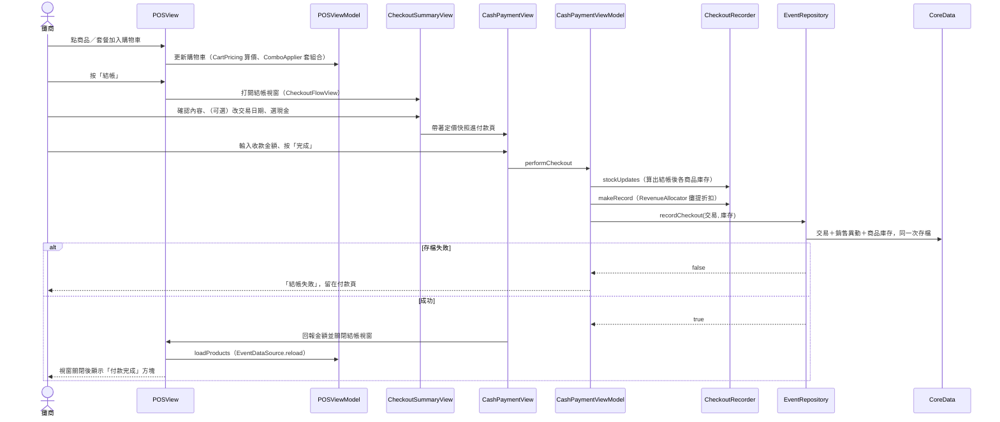

# 結帳（現金）

收銀頁從購物車到寫入交易。電子支付的流程相同，只是付款頁換成 `EPaymentView`／`EPaymentViewModel`。
交易、銷售扣庫存的異動、商品庫存在**同一次存檔**完成，失敗時全部不留。

```mermaid
sequenceDiagram
    actor U as 攤商
    participant POSView
    participant POSViewModel
    participant CheckoutSummaryView
    participant CashPaymentView
    participant CashPaymentViewModel
    participant CheckoutRecorder
    participant EventRepository
    participant DB as CoreData

    U->>POSView: 點商品／套餐加入購物車
    POSView->>POSViewModel: 更新購物車（CartPricing 算價、ComboApplier 套組合）
    U->>POSView: 按「結帳」
    POSView->>CheckoutSummaryView: 打開結帳視窗（CheckoutFlowView）
    U->>CheckoutSummaryView: 確認內容、（可選）改交易日期、選現金
    CheckoutSummaryView->>CashPaymentView: 帶著定價快照進付款頁
    U->>CashPaymentView: 輸入收款金額、按「完成」
    CashPaymentView->>CashPaymentViewModel: performCheckout
    CashPaymentViewModel->>CheckoutRecorder: stockUpdates（算出結帳後各商品庫存）
    CashPaymentViewModel->>CheckoutRecorder: makeRecord（RevenueAllocator 攤提折扣）
    CashPaymentViewModel->>EventRepository: recordCheckout(交易, 庫存)
    EventRepository->>DB: 交易＋銷售異動＋商品庫存，同一次存檔
    alt 存檔失敗
        EventRepository-->>CashPaymentViewModel: false
        CashPaymentViewModel-->>U: 「結帳失敗」，留在付款頁
    else 成功
        EventRepository-->>CashPaymentViewModel: true
        CashPaymentView->>POSView: 回報金額並關閉結帳視窗
        POSView->>POSViewModel: loadProducts（EventDataSource.reload）
        POSView-->>U: 視窗關閉後顯示「付款完成」方塊
    end
```
