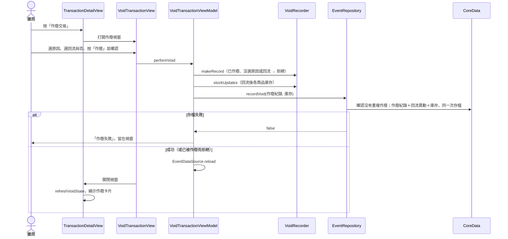

# 作廢交易

交易明細頁作廢一筆交易。交易本身不改不刪，另外新增一筆作廢紀錄（`CDTransactionVoidEntity`）；
選「回流」時再新增「作廢回流」庫存異動並加回庫存。三者同一次存檔。

```mermaid
sequenceDiagram
    actor U as 攤商
    participant TransactionDetailView
    participant VoidTransactionView
    participant VoidTransactionViewModel
    participant VoidRecorder
    participant EventRepository
    participant DB as CoreData

    U->>TransactionDetailView: 按「作廢交易」
    TransactionDetailView->>VoidTransactionView: 打開作廢視窗
    U->>VoidTransactionView: 選原因、選回流與否、按「作廢」並確認
    VoidTransactionView->>VoidTransactionViewModel: performVoid
    VoidTransactionViewModel->>VoidRecorder: makeRecord（已作廢、沒選原因或回流 → 拒絕）
    VoidTransactionViewModel->>VoidRecorder: stockUpdates（回流後各商品庫存）
    VoidTransactionViewModel->>EventRepository: recordVoid(作廢紀錄, 庫存)
    EventRepository->>DB: 確認沒有重複作廢；作廢紀錄＋回流異動＋庫存，同一次存檔
    alt 存檔失敗
        EventRepository-->>VoidTransactionViewModel: false
        VoidTransactionViewModel-->>U: 「作廢失敗」，留在視窗
    else 成功（或已被作廢而拒絕）
        VoidTransactionViewModel->>VoidTransactionViewModel: EventDataSource.reload
        VoidTransactionView->>TransactionDetailView: 關閉視窗
        TransactionDetailView->>TransactionDetailView: refreshVoidState，顯示作廢卡片
    end
```
