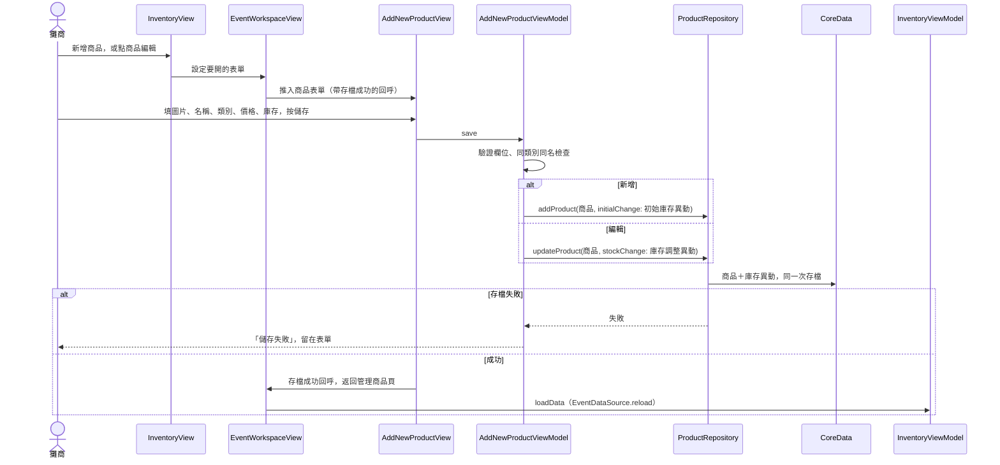

# 新增／編輯商品

商品與庫存異動（新增時的初始庫存、編輯時的庫存調整）在同一次存檔完成。

```mermaid
sequenceDiagram
    actor U as 攤商
    participant InventoryView
    participant EventWorkspaceView
    participant AddNewProductView
    participant AddNewProductViewModel
    participant ProductRepository
    participant DB as CoreData
    participant InventoryViewModel

    U->>InventoryView: 新增商品，或點商品編輯
    InventoryView->>EventWorkspaceView: 設定要開的表單
    EventWorkspaceView->>AddNewProductView: 推入商品表單（帶存檔成功的回呼）
    U->>AddNewProductView: 填圖片、名稱、類別、價格、庫存，按儲存
    AddNewProductView->>AddNewProductViewModel: save
    AddNewProductViewModel->>AddNewProductViewModel: 驗證欄位、同類別同名檢查
    alt 新增
        AddNewProductViewModel->>ProductRepository: addProduct(商品, initialChange: 初始庫存異動)
    else 編輯
        AddNewProductViewModel->>ProductRepository: updateProduct(商品, stockChange: 庫存調整異動)
    end
    ProductRepository->>DB: 商品＋庫存異動，同一次存檔
    alt 存檔失敗
        ProductRepository-->>AddNewProductViewModel: 失敗
        AddNewProductViewModel-->>U: 「儲存失敗」，留在表單
    else 成功
        AddNewProductView->>EventWorkspaceView: 存檔成功回呼，返回管理商品頁
        EventWorkspaceView->>InventoryViewModel: loadData（EventDataSource.reload）
    end
```
