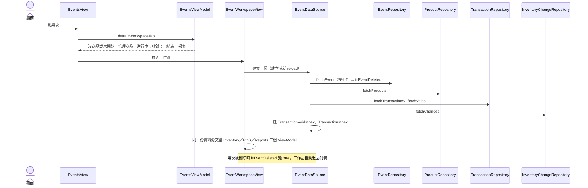

# 進入場次工作區

點場次後建立一份 `EventDataSource`，三個分頁共用。之後各分頁出現時（`onAppear`）呼叫 `reload` 取最新快照，
頁面之間不互相通知。

```mermaid
sequenceDiagram
    actor U as 攤商
    participant EventsView
    participant EventsViewModel
    participant EventWorkspaceView
    participant EventDataSource
    participant EventRepository
    participant ProductRepository
    participant TransactionRepository
    participant InventoryChangeRepository

    U->>EventsView: 點場次
    EventsView->>EventsViewModel: defaultWorkspaceTab
    EventsViewModel-->>EventsView: 沒商品或未開始→管理商品；進行中→收銀；已結束→報表
    EventsView->>EventWorkspaceView: 推入工作區
    EventWorkspaceView->>EventDataSource: 建立一份（建立時就 reload）
    EventDataSource->>EventRepository: fetchEvent（找不到 → isEventDeleted）
    EventDataSource->>ProductRepository: fetchProducts
    EventDataSource->>TransactionRepository: fetchTransactions、fetchVoids
    EventDataSource->>InventoryChangeRepository: fetchChanges
    EventDataSource->>EventDataSource: 建 TransactionVoidIndex、TransactionIndex
    EventWorkspaceView->>EventWorkspaceView: 同一份資料源交給 Inventory／POS／Reports 三個 ViewModel
    Note over EventWorkspaceView,EventDataSource: 場次被刪除時 isEventDeleted 變 true，工作區自動退回列表
```
