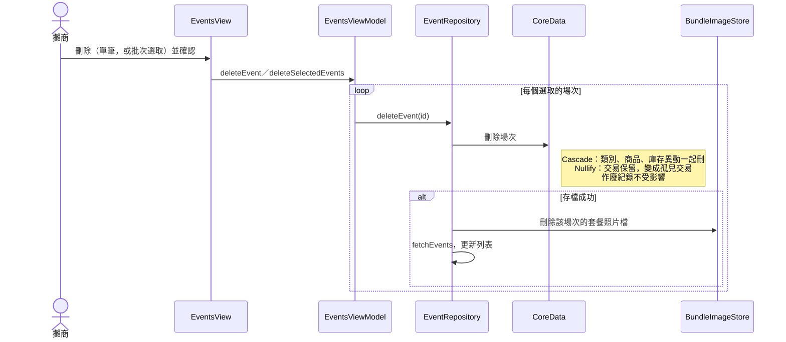

# 刪除場次（現況：硬刪除）

目前是真的刪掉，不檢查有沒有交易。類別、商品、庫存異動由 CoreData Cascade 一起刪除；
交易保留但不再屬於任何場次。改成軟刪除的規劃見 `FEATURE_PLAN_V2.md` §2.2。

```mermaid
sequenceDiagram
    actor U as 攤商
    participant EventsView
    participant EventsViewModel
    participant EventRepository
    participant DB as CoreData
    participant BundleImageStore

    U->>EventsView: 刪除（單筆，或批次選取）並確認
    EventsView->>EventsViewModel: deleteEvent／deleteSelectedEvents
    loop 每個選取的場次
        EventsViewModel->>EventRepository: deleteEvent(id)
        EventRepository->>DB: 刪除場次
        Note right of DB: Cascade：類別、商品、庫存異動一起刪<br/>Nullify：交易保留，變成孤兒交易<br/>作廢紀錄不受影響
        alt 存檔成功
            EventRepository->>BundleImageStore: 刪除該場次的套餐照片檔
            EventRepository->>EventRepository: fetchEvents，更新列表
        end
    end
```
