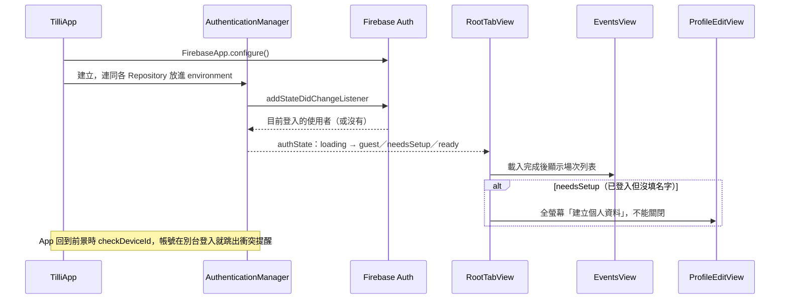

# App 啟動與登入狀態（現況，第 1 批移除）

目前啟動時會設定 Firebase 並監聽登入狀態。`FEATURE_PLAN_V2.md` 第 1 批移除登入後，
App 會直接進場次列表，這張圖要跟著改。

```mermaid
sequenceDiagram
    participant App as TilliApp
    participant AuthenticationManager
    participant FB as Firebase Auth
    participant RootTabView
    participant EventsView
    participant ProfileEditView

    App->>FB: FirebaseApp.configure()
    App->>AuthenticationManager: 建立，連同各 Repository 放進 environment
    AuthenticationManager->>FB: addStateDidChangeListener
    FB-->>AuthenticationManager: 目前登入的使用者（或沒有）
    AuthenticationManager-->>RootTabView: authState：loading → guest／needsSetup／ready
    RootTabView->>EventsView: 載入完成後顯示場次列表
    alt needsSetup（已登入但沒填名字）
        RootTabView->>ProfileEditView: 全螢幕「建立個人資料」，不能關閉
    end
    Note over App,AuthenticationManager: App 回到前景時 checkDeviceId，帳號在別台登入就跳出衝突提醒
```
